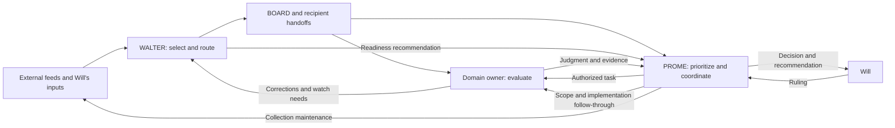

# WALTER and PROME — how the partnership works

October 2, 2026 · CATO · requested by Will for system direction.

**Latest follow-up, October 3 at 18:04 ET:** [system-improvement handoff review](#october-3-system-improvement-handoff-review) supports stopping broad backlog work on diminishing returns, with unassessed material retained. PROME has consumed the new handoff. Correct the coverage overclaim, WQ-380's conditional-versus-unconditional summary, and caching-versus-context inference before using the candidate report to authorize changes. This is advice, not a new build or send.

**Closeout follow-up, October 3 at 18:23 ET:** WALTER `ef91182cd` still needs bounded coverage/method corrections and its due local-memory cleanup. No new collection or broad audit recommended. Detailed follow-up at the end of this report. Owner reports Will ratified STOP; PROME's queue still carries a recommendation, so preserve the ruling source and reconcile the consumer rather than ask Will again if already approved.

**Keep the division of responsibility. Improve the handoffs that turn a collected item into a timely owner judgment.** WALTER supplies selected evidence and detects receiving desks that need attention. PROME allocates work, checks owner returns, preserves approvals and presents decisions to Will. The design can reduce Will's coordination burden, and a recent BRENT session demonstrates that mechanism. Its reliability is uneven: collection, filtering, recipient availability and decision pickup run on separate clocks, and good delivery records do not establish that the evidence was used in time.

This is an analysis and recommendation, not an implementation assignment. No owner files, collection schedules, routing rules or approval policies were changed. No agents launched or messages sent. The forecast pilot remains approved and untriggered.

## Evidence and limits

Read the relevant owner instructions, delivery/filter specifications, PROME boot and orchestration rules, current completion/handoff records, selected code and September 30–October 2 packets and ledgers. Started from shared HEAD `7e69c1e4a`; evidence snapshot for this report is `49e0ef1b2bf908796b56090d1387b58edcd10721`. Concurrent owners committed during inspection. Checked the intervening changes to the sampled WALTER logs: additions did not alter the October 1 rows used below. Clean Git observations do not establish idle owners.

This is a bounded relationship review, not a fleet census, an operational boot, a fresh market assessment or a new acceptance read of an owner's repair. Static code inspection and cross-checks at recipient artifacts establish only the stated scope. Collector deployment and its independent reviews are PROME-reported; neither the remote deployment nor its first production run was reverified. Financial claims in packets are described as examples of workflow, not independently recertified facts. Prior CATO intake/scanner work is author follow-up, not newly independent validation. No net time saving, trading edge or fleet-wide miss rate is established.

## The operating relationship

| Stage | WALTER's job | PROME's job | Evidence that the handoff worked |
|---|---|---|---|
| Collection | Consume Research-Intake; inspect Will's drops and returned research; expose degraded feeds | Maintain the collection lane and land tested source/query changes | Healthy retrieval evidence and a batch available to WALTER, not merely a successful scheduled job |
| Selection | Verify enough to frame a claim; assess novelty, relevance and credibility; identify domain and urgency | Supply current priorities through shared decision, position and catalyst records; resolve scope/authority questions | A signal with source limits and the correct ACTION/INFO recipients, or a reasoned kill |
| Delivery | Publish BOARD evidence and required recipient handoffs; maintain route/delivery records and corrections | Read the committed BOARD diff; receive operational packets at `PROME/inbox/` | Publication and delivery recorded separately; a direct ask reaches its owner |
| Mobilization | Identify unavailable recipients and recommend attention under the existing doorbell rule | Check presence and authority; launch/re-ping bounded owner work or seek a new-direction ruling | An authorized task with a named owner and deliverable |
| Judgment | Preserve provenance and route corrections; do not take over domain grading | Verify the owner's return, register resulting work/decisions, synthesize for Will | Owner judgment and current artifacts; a disposition that reaches its decision consumer |
| Follow-through | Keep outstanding delivery/readiness and Will-actionable items visible | Carry dated obligations, approvals, implementation confirmation and spawned-desk closeout | Closed loop or explicit remaining obligation, not a filed packet alone |

Sources: `AGENTS/WALTER/CLAUDE.md` identity and steps 7d–9b/11; `PROME/BOOT.md` steps 3b/6 and news-routing module; `PROME/CLAUDE.md` identity and Ask First; `PROME/ORCHESTRATION_PLAYBOOK.md` two-tier model. `PROME/ROSTER.md` owns fleet membership/cadence; WALTER's registry owns routing/delivery information. Those are complementary records, not two competing rosters of authority.

This is a feedback loop, not simply WALTER handing a news digest to PROME. Domain owners tell WALTER what to watch and correct its framing. WALTER tests whether the searches and phrases can find those events. PROME turns that evidence into lane changes and work assignments. Will also supplies inputs directly and launches sessions; neither agent is autonomous end to end.

PROME deliberately avoids duplicating every information-only handoff. It scans BOARD and ordinarily receives no duplicate WALTER inbox copy for INFO-only dispatches. An ACTION ask still receives the fail-safe handoff. Operational notes remain a separate packet channel. This is a sensible attention-saving boundary, conditional on the scanner working and the ACTION metadata being accurate. Sources: `BOARD_CONSUMPTION_SPEC.md` §§3.5, 3.5.1, 3.5.4 and 3.5.8(a).

## What the evidence shows working

**A WALTER recommendation can produce useful owner work without another permission cycle.** PROME's October 1 BRENT touch explicitly cites WALTER's report of an unavailable desk with energy ACTION items. PROME launched it at 13:17 ET under existing Tier-1 authority. BRENT's return records primary-source checks, thirteen inbox dispositions, registration of an already-approved prediction and correction of its position record. Its substantive result was “nothing fires”: news significance did not get mistaken for a registered trade condition. PROME's orchestration row also records the closeout ask and answer, while preserving the outstanding settle-window work. Evidence: `PROME/state/ORCH_LOG.tsv` BRENT October 1 row; `PROME/inbox/processed/2026-10-01_from-BRENT_L0-drain-phase1-nothing-fires.md`. This demonstrates a useful handoff, not a measured return on the whole system.

**The producer/consumer split supports corrective challenge.** WALTER tested PROME's proposed search queries and found combined OR expressions returning fewer useful items than separate legs, including a missing Egan-Jones leg. It also refuted PROME's claim that the leading recency operator was ineffective. The owner supplied measured counterexamples before PROME landed changes. Evidence: `PROME/inbox/processed/2026-10-01_from-WALTER_lane-queries-A-E-sizing.md`; PROME's October 1 afternoon HANDOFF entry acknowledges the correction. The search measurements are WALTER's, not replicated here.

**The records permit a distinction between delivery and later use.** Diesel signal `SIG-W-20261001-026` was routed to BRENT at 20:47:24Z on October 1. BRENT's `board_log.tsv` records action at 08:36:47 EDT on October 2 and the handoff is in its processed lane. The owner checked the registered rule and recorded that it had not fired. By contrast, mortgage signal `-025` remained in HOMER's pending lane with no matching row in the inspected `board_log.tsv`. That is evidence of different recorded consumption states, not proof of a harmful delay or that HOMER never saw the information elsewhere. Sources: the two recipient handoffs, recipient ledgers and WALTER's delivery log. Do not infer average latency from this pair.

## Consequential constraints

### WP1 — high priority: information can disappear before routing begins

The earlier intake review established that ordinary `NEW` news is omitted from WALTER's generated worklist; the current `intake_scan.py` news branch still handles alerts, watch classes and known-entity developments without ordinary NEW. This is narrower than claiming a desk without watch phrases receives nothing. WALTER also found two historical batches with zero **saved** Google-source items while the producer reported healthy. Saved output does not prove zero successful retrieval, and the historical cause remains unknown.

PROME reports per-leg counters deployed as Research-Intake `429f948`; the acceptance record preserves an unresolved, pre-existing write-order failure in which seen-state can advance before output is saved. That repair is already registered as L570. More routing discipline cannot recover material that was never collected or never surfaced.

**Recommended action:** finish that existing repair and inspect a production batch with demonstrated healthy retrieval, then use the previously proposed one-batch coverage comparison to separate useful unsurfaced candidates from duplicates and noise. **Owners:** PROME for producer, WALTER for consumer/triage. **Closure:** healthy/degraded retrieval is visible at the consumer, retries preserve output, and the bounded comparison establishes whether ordinary NEW review adds enough useful evidence to justify its cost. It does not authorize a permanent new review routine.

Evidence: CATO's `2026-10-01_1400_walter-intake-direction.md` WI1/WI4; WALTER's `research/2026-10-01_intake-bounded-comparison.md`; `intake_scan.py` news branch; `PROME/tools/tests/ACCEPTANCE_newsweep_leg_counters_L569.md`; DOCKET L569/L570. The counters diagnose future failures; their installation alone does not establish collection reliability.

### WP2 — high priority: WALTER's relevance judgments depend on context it reports skipping

`FILTER_SPEC.md` Boot Context requires scoped owner-state, position-mirror, catalyst and recent-disposition reads. These supply the meaning of “new,” “relevant” and “already known.” WALTER's latest saved completion explicitly reports those reads skipped for a sixth consecutive session. That is a consequential execution gap, not evidence that every dispatch was wrong. Manual verification and Will-supplied context may compensate, but the report does not establish equivalent coverage.

**Recommended action:** WALTER should restore the existing scoped reads at its next authorized session and state any remaining gaps. If the workload makes them impractical, bring a concrete reduction to the owner process rather than silently treating them as optional. **Closure:** evidence that the required context was consulted before filtering, or an explicitly approved replacement with its coverage limits. Adding a reminder would not solve a consciously skipped step.

Evidence: `AGENTS/WALTER/design/FILTER_SPEC.md:9` and `AGENTS/WALTER/LAST_COMPLETION.md` STATUS/GAPS. This is owner-reported execution evidence, not a replay of six sessions.

### WP3 — medium priority: several independent clocks govern responsiveness

Collection can be scheduled while WALTER still needs a session to consume it. A recipient can remain unavailable after dispatch. PROME can receive an owner answer yet wait for another decision-publication cycle. The roster explicitly labels WALTER DAILY while explaining that it is Will-launched and cannot self-wake. Increasing collector frequency alone therefore cannot guarantee faster owner judgment.

There are already two complementary mobilization paths: WALTER's event/readiness recommendation and PROME's dated-obligation driver. The latter is important because a registered due task does not need a fresh WALTER signal to become actionable. PROME also has aged-ACTION and aged-waits grants, with their existing limits. The October 1 Decision Deck record supplies a separate example: six answers waited roughly 3.5 hours for the next pickup. L580 now registers that issue; it is not a new CATO proposal.

**Recommended action:** judge the next timing change by the bottleneck it actually removes: retrieval, WALTER triage, owner availability or ruling pickup. Start with the existing work and recorded handoffs, not another dashboard. **Closure:** a time-sensitive example reaches a verified owner disposition before its named usefulness deadline. Nothing in this sample proves that an additional daily session or faster collection is the best marginal purchase.

Evidence: `PROME/ROSTER.md` WALTER cadence row; `PROME/CLAUDE.md` Ask First; `MESSAGING/CROSS_SESSION_MESSAGING.md` rule 6b; `PROME/HANDOFF.md` October 1 late entry. WQ-348 C7 now permits PROME's bounded free-feed/schedule changes; the older “needs Will's word” descriptions must not be used to request that same authority again. WALTER launch/cadence authority is a separate question.

### WP4 — medium priority: readiness records need a defensible reason for not escalating

The October 1 doorbell rows for HOMER `-025` and BRENT `-026` record L3b failing with “PRIORITY; cadence not the deadline,” without a p75/dark-duration basis. The governing cadence limb tests dark duration against the desk's own p75 gap; signal precedence is not that test. Recent desk activity may make the non-escalation correct—BRENT had closed out that afternoon—but these rows do not demonstrate it. This review did not recompute desk histories or establish an eligible missed doorbell.

**Recommended action:** on the next normal readiness pass, WALTER should use the existing cadence basis or explicitly mark it not computable; PROME should distinguish “no demonstrated reason to wake” from “tested and not due.” **Closure:** the sampled non-escalation can be reproduced from the rule's inputs. No new gate, blanket waking or retrospective fleet audit is recommended.

Evidence: `AGENTS/WALTER/registry/DOORBELL_LOG.tsv` the two signal/desk rows; `BOARD_CONSUMPTION_SPEC.md` §3.5.7; messaging rule 6b. Material consequence is uncertainty about the selection process, not a proven research miss.

### WP5 — medium priority: PROME's information-only exemption depends on an incompletely repaired scanner

The scanner now reads committed BOARD files and keeps a per-file/blob record, addressing the old unfinished-draft and late-lower-ID problems. Static inspection agrees with that design. Its acceptance record still lists consequential residual cases and three operating restrictions. WALTER has since confirmed committed publication and says changed asks must be new signals; that narrows normal exposure to in-place ask changes but does not independently close the code defects. Owner confirmation also supersedes the acceptance file's earlier “publication semantics unconfirmed” caveat.

**Recommended action:** complete WQ-350's already-authorized bounded repair/read in its permitted process slot; retain the operating restrictions until disposition. **Owner:** PROME, with WALTER defining publication behavior. **Closure:** acceptance file updated with the named reader's result and honest residual limits. Do not treat more review rounds or a green scanner as proof every relevant signal reached a decision.

Evidence: `PROME/tools/board_scan.py`; `PROME/tools/tests/ACCEPTANCE_board_scan_publication_2026-09-30.md`; `PROME/inbox/processed/2026-10-01_from-WALTER_board-scan-publication-answers.md`; DOCKET L562/WQ-350. This report adds no repair verification round.

## Direction for Will

Retain WALTER's editorial judgment and PROME's control of work allocation. Giving WALTER broad launch authority or making PROME triage every raw headline would add responsibility without first resolving the observed handoff failures. Both agents already have substantial mechanisms; the immediate opportunity is dependable execution and completion of existing repairs.

After due decision work, prioritize the producer/consumer repair and healthy-batch observation, restore WALTER's relevance context, and finish the approved scanner and pickup work within their existing sequencing limits. Use an existing time-sensitive signal as the practical test: what changed, who evaluated it, when, and what decision did it affect? A reasoned “nothing changes” is a useful outcome. A delivered file alone is not.

For a next discussion, the central design choice is **how much of discovery Will wants the system to perform without his screenshots and manual launches**. The current design assists that work but does not demonstrate dependable independent coverage. Set that desired service before considering more feeds, frequency or autonomy. No new ruling is requested by this report, and no implementation begins on its advice alone.

## Side investigation — direct X intake

Will asked during this review whether WALTER could have an X login, receive the news notifications he sees on his phone, and act on relevant items. **The collection-and-triage workflow is feasible; exact reproduction of his personalized notification feed is not established.** “Act” here means verify, classify, record and route research through existing authority, not publish from the account or execute trades.

Anthropic documents that Claude Code's Chrome integration shares the browser's authenticated state, can extract page content, and pauses for manual login/CAPTCHA handling. Its documented long-session connection failures make access different from unattended reliability. It also does not support WSL; this review did not inspect Will's installation or establish its browser compatibility. X's automation rules prohibit non-API website automation, so the proposed durable path is the official API rather than an unattended browser reading the account. [Claude Code Chrome documentation](https://code.claude.com/docs/en/chrome); [X automation rules](https://help.x.com/en/rules-and-policies/x-automation).

X's Filtered Stream currently supports account and keyword rules, near-real-time delivery, and pay-per-use access. An explicit set of news accounts can therefore feed a collector independently of phone notifications. That does not establish access to X's personalized recommendation/notification selection, private posts or every media item's complete content. **Will clarified that his useful notifications are a mixture of selected-account alerts and X recommendations.** A selected-account feed would replace only part of his discovery; the recommendation component may find unfamiliar accounts/topics and must be evaluated separately. [X Filtered Stream documentation](https://docs.x.com/x-api/posts/filtered-stream/introduction).

Published pricing checked October 2 is **$0.005 per post read**: 1,000 posts would be $5 in post-read charges, excluding additional resources, model use and hosting. Actual developer-account access and costs have not been tested; prices can change. A narrow source list makes spend and review volume easier to bound. [X pricing](https://docs.x.com/x-api/getting-started/pricing).

**Proposed fit:** an X collector supplies the existing intake architecture with post identity, author, publication/collection times, text and source/media links; WALTER deduplicates and verifies consequential candidates; normal BOARD/recipient paths carry the result; PROME manages owner attention. Preserve source content as evidence, never as executable instructions. Collecting while WALTER is absent requires durable queuing and visible collection failures. A separate, explicitly authorized wake/triage arrangement is needed for prompt response; a feed by itself does not confer launch authority or create an always-on WALTER.

**Suggested first decision, not an approved build:** cost a narrow account-source feed and compare its coverage against examples from BOTH kinds of useful notification. Keep recommendation-originated discoveries visible through the existing manual input path while their automated equivalent remains unestablished. Expanding keyword rules can be tested for discovery, but is not evidence of reproducing X's recommender. Judge incremental useful evidence, delay and attention saved, not total posts collected. This could reduce manual forwarding, but its value is not demonstrated yet. No account was accessed, credential requested, app installed, subscription purchased, collector built or wake mechanism enabled.

## October 3 bookmark follow-up and session close

Will relayed successive WALTER pilot updates and requested CATO's feedback and implementation status. The bookmark channel recovered concrete leads, but its net benefit and whole-stream filtering quality remain unproven. Two recovered image-based items establish a retrieval/triage failure mode, not its frequency or their ultimate research value. Post-creation dates do not establish bookmark dates; no-dispatch does not establish healthy filtering.

Standing advice: classify financial research, system-improvement candidates and personal/no-action separately from assessment status; attempt plausible media/link content before rejecting; retain inaccessible/unread items as not-assessed; preserve stable IDs; dispatch according to consequence. NOTE is non-actionable-only and un-instrumented, not a substitute for tracked asks. Keep bookmarking easy for Will. Attribute the dated JPM forecasts to the note and the insurer analysis to MISPRICED ASSETS/Wyandanch, with one of 23 pages read; neither is independently verified current fact.

Earlier artifact inspection through `633a83fcf` confirmed the two leads' caveats and concrete owner questions: JPM `-009` to BRENT, FALCON/CRUISE info; insurer `-010` to SHADE, BROCK info. At that inspection, the production fetcher still requested author/post metadata without media/link expansions, while expanded retrieval had been done with scratch scripts. Durable method and test records were then incomplete.

In Will's latest relayed update, WALTER reports preserving the method in `design/X_BOOKMARKS_ACCEPTANCE.md` section 9, dispositions in `research/2026-10-03_x-bookmark-backlog-triage.md`, and a memory pointer; reconciling the narrow live expired-token success in section 8; and updating LAST_COMPLETION with a passing closeout receipt. Refresh failure, seed-failure and 429/network failure paths remain unobserved live. Those latest edits are owner-reported, not a fresh CATO artifact audit. WALTER explicitly leaves production media/link expansion undone as a separate task.

At that update, latest commits were local and delivery still pending. CATO advised coordinating PROME's push, verifying arrival and finishing closeout. During CATO's own closeout, shared history at `723b98800` contains `a429ef660` (WALTER closeout breadcrumb) and `c48a62d47` (delivery-log reconciliation claiming all 11 rows delivered via PROME's train). Those subjects update the resume pointer; CATO has not re-audited receipt contents or owner consumption. Do not preserve the earlier local-only claim as current fact.

Next useful work, if assigned: bounded production media/link fetch change before larger slice tooling. Hold further backlog processing pending direction and seek BRENT/SHADE dispositions (adds evidence, contradicts, duplicates) before claiming research benefit. CATO has not commissioned work, sent packets, launched recipients or edited WALTER. Discussion of DAEDALUS on Codex/Astra supplied a command and explicit instruction-reading prompt only; no CATO migration or launch occurred. Prior forecast-pilot authorization survives but was not triggered by this discussion or closeout.

### Session-close verification

Only CATO continuity and these two continuing reports are changed for this closeout. No code tests are needed for disposition-only edits. Foreign PROME/DAEDALUS/script changes are active shared work and remain untouched; no pull performed. Required check results follow below; delivery receipt belongs in-session.

Weekday check passed after verifying all six inputs readable: `PROME/DOCKET.tsv`, `PROME/GATES.tsv`, `PROME/WILL_QUEUE.md`, `AGENTS/CATO/CONTINUITY.md`, this report, and `AGENTS/CATO/runs/2026-10-03_1438_helm-split-review/README.md`. Optional CATO STATUS/calendar/catalyst files remain absent. Direct startup sizes: CATO AGENTS 6,465 B, CHARTER 9,921 B, CONTINUITY 8,456 B; root CLAUDE 24,199 B, USER 4,626 B, AGENTS 4,991 B. All readable and below 32,550 B. Generic read-cap check returned rc 2, CANNOT-EVALUATE for the absent local CLAUDE.md; the checker itself has concurrent DAEDALUS edits, and this result is not a pass. Orphan advisory found foreign working files only, no CATO-authored external packet. Whole-tree whitespace check flags foreign PROME ORCH_LOG trailing tabs; leave owner data untouched and scope CATO's final whitespace check to its three paths. No ledger-nudge, memory-index or consumer-figure condition triggered. No retirement is due for CATO's files, established less than 60 days ago.

## October 3 system-improvement handoff review

Will requested CATO involvement in WALTER's system-improvement/backlog thread. Current recommendation: stop broad tail processing on opportunity cost, preserve unread material, and evaluate only a small number of candidates against actual failures. The report has reached its consumers; evaluation and adoption remain separate. No WALTER/PROME/DAEDALUS files, configuration or token stores changed; no messages, canary run, collection or agent launch.

### WP6 — financial coverage overclaim (medium)

WALTER's relayed summary says the backlog is fully reviewed and nothing remains to extract. Its durable `research/2026-10-03_x-bookmark-backlog-triage.md` instead marks approximately 151–287 unprocessed, financial videos #64/#76/#86 not-assessed, and link #85 assessable but not yet assessed. Its system-improvement report describes a system/process pass over 299 bookmarks and says financial posts were almost certainly absorbed. Those are different review scopes. Older post dates do not establish when Will bookmarked them or that a desk already used them. No new financial source assessment occurred in this CATO pass.

**Advice:** WQ-377(b) STOP is reasonable after two empty financial slices and an apparently low-yield tail, but preserve it as an economic stop with incomplete coverage. Do not translate unread items into rejected items or claim exhaustiveness. The current working WQ-377 row already corrects this distinction and retains Will's last instruction to continue; CATO recommends a new stop ruling, not treating WALTER's recommendation as that ruling. Closure: WALTER's final summary/disposition agrees with this limited coverage and the unread set remains reachable. No exhaustive replay required.

### WP7 — security proposal and summary diverge (medium)

The relayed WALTER text says install the deny rule only if a canary reproduces unprompted reads. Actual WQ-380 recommends installation **whatever** the test finds. That is materially different approval scope; no ruling is inferred here. The social post's unprompted-read claim remains unverified, and a single negative startup test would establish only that run's behavior. Gitignore evidence concerns Git handling, not model access; CATO did not inspect token contents or certify their history.

Anthropic's [permissions documentation](https://code.claude.com/docs/en/permissions#read-and-edit) says Read denies cover built-in file tools and recognized shell file commands, but not arbitrary Python/Node subprocess reads. Thus a deny can reduce accidental exposure without creating a complete secret boundary. [Settings documentation](https://code.claude.com/docs/en/settings#where-claude-code-looks-for-each-file) also makes launch-directory/configuration scope relevant. Installed CLI reports 2.1.288; effective settings and behavior were not tested.

**Advice:** narrow the next authorization to harmless-canary verification and a concrete configuration proposal. Test blocked direct reads, applicable indirect paths, actual desk launch directories, and continued operation of the intended token-using scanner without printing credentials. State residual access explicitly; do not equate the scanner retaining Python access with proving arbitrary Python cannot disclose the same file. Then approve the demonstrated protection and exact scope. No fleet configuration copy or OS sandbox redesign is commissioned by this review. Closure: WQ and operator summary describe the same proposal, with tested protection and limits. The decisive uncertainty is protection achieved, not whether the alarming post happens to reproduce once.

### WP8 — candidate claims are outrunning their evidence (medium for the token inference)

The report correctly labels its sources as posts/thumbnails/expanded links, not the underlying talks/repos. But its packet says the posts directly quantify our cost structure and calls prompt caching a read-cap/charter remedy. Anthropic documents [caching as a cost/latency optimization](https://platform.claude.com/docs/en/build-with-claude/prompt-caching); [cached tokens still occupy context](https://platform.claude.com/docs/en/build-with-claude/context-windows). The small uncached `input_tokens` field is not total input. Therefore the reported 108k-to-11 claim is not evidence of a comparable context reduction, and cached large instructions do not fix a file-read truncation limit. Actual request/cost metrics are needed before recommending a harness-specific optimization.

The sampled disk sizes are WALTER CLAUDE 65,767 B + root CLAUDE 24,199 B + memory/auto/MEMORY 17,937 B = 107,903 B. This substantiates the approximate sum of those files only: not a token count, measured runtime injection, fleet-wide boot size, wasted fraction or caching saving. No actual model request was inspected. Also, a similar supervisor/specialist topology in the JPMorgan post is an analogy, not evidence our implementation is institutionally validated or efficient.

**Advice:** DAEDALUS's L603 pass should first retrieve the underlying primary resource and test relevance. Select one or two candidates that address known failures; defer broad reading lists. A document-converter candidate should be compared on a document WALTER actually mishandled, against the existing extraction route, before adopting it. Carry stable post IDs/direct links because bookmark ordinals shift. Keep process improvement candidates, hypotheses and demonstrated benefits distinct. Closure: claims retain attribution and any proposed adoption names a concrete advantage over current tooling, demonstrated on an applicable case. No quantitative token or accuracy improvement is accepted from these posts alone.

### Handoff, scheduling and publication observations

The WALTER report and two packets exist at `50f81979c`/`fbdbd4096`; PROME's processed coordination packet and `38275130e` establish consumption and registration of L603/WQ-380. L603 targets October 12 and expressly protects L490/L594 through an October 5 scope check. That scope check matters: October 12 already holds eleven profile refreshes and other work, so registration alone does not establish spare capacity. Accept deferral as a valid evaluation disposition rather than turning all candidates into builds.

The same coordinator commit supplies DAEDALUS's previously missing handoff receipt and L604 for slate B1/B2. This updates DC1's delivery evidence; acceptance and scheduling dispositions remain due October 5. See the brief follow-up in CATO's continuing DAEDALUS report. No new code review triggered.

WALTER's push deferral has a real desk-specific basis: BOARD_CONSUMPTION_SPEC section 7 requires Will-coordinated pushing outside the narrow urgent exception. Do not tell it to ignore that. But a dirty shared tree is a pull hazard, not itself a reason an authorized safe-push would overwrite working files. Fresh publication ancestry, not counts of purported pending commits, determines delivery. CATO fetched origin without pulling and checks the relevant commits below; do not preserve a stale local-only claim after confirmation.

WQ-377 remains three separable decisions: stop the backlog, expand production retrieval, and wire the scan at boot. Support prioritizing the existing bounded media/link fetch change before relying routinely on the boot lane. Boot wiring runs on WALTER launch and does not by itself provide unattended coverage. The prior live token-refresh success and untested failure legs remain recorded in X_BOOKMARKS_ACCEPTANCE sections 8/9; no new live reliability claim.

### Follow-up verification and stop condition

Read the WALTER report, triage record, two packets, relevant acceptance sections and push authority; selected current WQ-377/380 and DOCKET L490/530/538/603/604 rows; DAEDALUS handoff and receipt commit; official Anthropic documentation. Snapshot began at `c5cd19407ee48490ee081870d51102b46881c45b`. PROME has active uncommitted rotations; current WQ-377's 17:5x correction is working-tree evidence and may change. DAEDALUS started scorecard files during this review; no assessment of in-flight output. No full underlying bookmark-source review, settings test, secret read, code edit, consumer-result audit or new broad sweep. Existing decision records are the handoff destination if Will chooses further work. Stop after delivering these bounded corrections; no approval to implement or send follows from the review.

Checks: fresh-fetch ancestry confirmed all four named commits (`50f81979c`, `fbdbd4096`, `38275130e`, `c5cd19407`), each rc=0; the report/packets are therefore already published, superseding the relayed local-only claim. Weekday rc=0 after reading all six checked paths: PROME DOCKET, GATES, WILL_QUEUE; CATO CONTINUITY; this report; DAEDALUS catch-up report. Direct startup bytes: CATO AGENTS 6,465, CHARTER 9,921, CONTINUITY 9,025; root CLAUDE 24,199, USER 4,626, AGENTS 4,991. All below cap. Generic CATO read-cap rc=2 CANNOT-EVALUATE for missing local CLAUDE, not a pass. Orphan advisory lists active foreign DAEDALUS/PROME/memory work; none authored by CATO here and all preserved. Exact three CATO paths pass whitespace check. Index was empty at the initial check; three DAEDALUS scorecard paths were staged concurrently before commit and excluded by CATO's exact pathspec. Resulting CATO commit paths were inspected. No code tests needed; no ledger, memory or superseded-domain-figure trigger. Final receipt in-session.

## Original October 2 verification and delivery

Repository evidence review and static inspection; official public documentation browsed for the X side question. No operational gates, scanner advancement, collection, remote market/deployment verification, private-store reads or owner edits. Report and CATO continuity are the only intended delivery paths. Check results and publication receipt recorded at closeout below/in-session.

Closeout checks: orphan advisory clean; tracked and new-report diff whitespace clean. Weekday check passed after verifying all five actual inputs readable: `PROME/DOCKET.tsv`, `PROME/GATES.tsv`, `PROME/WILL_QUEUE.md`, `AGENTS/CATO/CONTINUITY.md`, and this report; repeated after Will's mixed-notification clarification. CATO has no optional STATUS/calendar/catalyst input. Direct startup byte measurements: CATO AGENTS 6,465; CHARTER 9,921; CONTINUITY 4,460 (rechecked after clarification); root CLAUDE 24,236; USER 4,626; AGENTS 4,991. All six readable and below 32,550 bytes. Generic `read_cap_check.py --agent CATO` returned rc 2, CANNOT-EVALUATE because there is no local CLAUDE.md; this is not a pass. No ledger, auto-memory or domain figure was changed, so their conditional checks do not apply. No code changed; no new tests were needed. Final path inspection and fresh-fetch push receipt belong in-session.

## October 3 closeout follow-up — 18:23 ET

Will asked whether WALTER had anything left to do after its Tier-2 closeout. Inspected `ef91182cd`, current LAST_COMPLETION, the changed method paragraph, local MEMORY header and byte count, relevant charter closeout rules, WQ-377/380, and the existing HANS packet. This is a narrow follow-up to WP6–WP8; no repeat delivery-log audit, doctor run, collection, configuration test or owner edit. Shared PROME/DAEDALUS work remains active.

**WP6 persists and has propagated:** LAST_COMPLETION STATUS/RESULT, STATUS, MEMORY and SESSION_LOG claim all 299 reviewed/backlog complete, while the underlying financial triage still carries unread/unprocessed material. WALTER reports Will ratified STOP; the current PROME WQ-377(b) still presents STOP as a recommendation awaiting a choice. A ruling can exist in the other session: do not infer it never happened. Preserve its exact source/time and have the coordinator reconcile that part of the existing row. No renewed permission needed if already granted. Correct coverage to financial triage through item 150 plus a system-lens pass over 299; retain the remaining unassessed set. A decision to stop does not require assessing it.

**New WP6 instance in acceptance section 9:** the closeout adds a general two-zero-route stopping rule and says a zero-route slice is a filter-health result. This session's earlier slice-2 false dismissal is a concrete counterexample to zero routes proving good filtering. Keep the observed yields and a case-specific diminishing-returns recommendation; do not promote them into a universal quality test or stopping policy without justification and applicable authority. Correction should travel to active summaries/method/memory, preserving dated history.

**WP9 — due local-memory maintenance (low operational severity; unfinished closeout step):** WALTER MEMORY measures 24,796 B; its explicit header says rotate above 24,412 B, and charter Tier-2 step 14 requires pruning above 100 lines (current file reports 116). It remains under the root 32,550-byte hard budget: no current truncation alleged. Deferring to avoid rushed work does not itself satisfy the triggered owner obligation. Recommend a bounded, content-preserving cleanup under WALTER's existing promotion/conservation method, then measure and run applicable checks. This is WALTER's local MEMORY.md, not an instruction to compact fleet auto-memory. Closure: due maintenance performed with content preserved, or an explicit authorized exception recorded; never restamp as clean.

READS and boot_basis remain UNKNOWN/review-required by WALTER's own closeout. Keep them explicit and refresh after the actual required source review before relying on the next boot's certification; no blind timestamp refresh. Their staleness is not proof the dispatch was wrong, and 4 MED / 0 HIGH does not independently establish completion. HANS remedy is already requested by `AGENTS/HANS/inbox/2026-10-02_from-WALTER_THRESHOLDS-tsv-over-read-budget.md`; leave the owner's remedy pending without duplicate dispatch or foreign edit. Media/link expansion, boot wiring and the security proposal remain separately gated work, not tasks silently added to this closeout.

The closeout commit was one ahead of origin at first inspection. WALTER's local charter explicitly defers its push on observed foreign dirty work; respect that desk-specific instruction. CATO's own required publication may carry the already-committed closeout on the shared train, with receipt in-session. No claim that an unspecified next sync automatically publishes it.

Follow-up checks: weekday rc=0 on five readable paths (PROME DOCKET/GATES/WILL_QUEUE, CATO CONTINUITY and this report); own-path whitespace clean. Startup bytes: CATO AGENTS 6,465 / CHARTER 9,921 / CONTINUITY 9,673; root CLAUDE 24,199 / USER 4,626 / AGENTS 4,991, all below cap. Generic CATO read-cap rc=2 for missing local CLAUDE, not a pass. Orphan advisory identified foreign DAEDALUS build/review files and PROME argus_baseline; preserved. Index empty at inspection; exact-path commit excludes concurrent work. No code, memory-auto, STATUS-ledger or superseded-figure check trigger. Final publication receipt in-session.

### Verification of WALTER correction f452d9d9d

Will relayed WALTER's correction/closeout and asked whether it was fixed. Bounded artifact check: the method paragraph now rejects automatic two-zero stopping and zero-route self-certification; STATUS and principal LAST_COMPLETION/triage passages distinguish financial coverage through 150 from the system-lens pass and withdraw the supposed Will ruling. No resumed collection is needed to accept those corrections.

WP6 remains open only for propagation: boot-read `MEMORY.md:97` still says Will ratified STOP and WQ-377(b) settled; LAST_COMPLETION line 46 still says backlog CLOSED. Memory header line 10 and LAST_COMPLETION GAPS line 27/JSON owed list still claim rotation due/deferred despite the new addendum. These are active consumer instructions, not labelled history. Reconcile them in one owner pass; no broad re-audit.

WP9 byte cleanup is verified: MEMORY now 23,489 B, below 24,412. Compared f452d9d9d parent MEMORY with current MEMORY: all 11 removed nonblank lines occur in MEMORY_PROMOTED. This confirms removed-line preservation, not a fresh run of the owner's full conservation harness. MEMORY remains 106 lines against charter step 14's >100 cleanup condition; finish that small residue without deleting evidence. Existing READS/boot_basis and HANS obligations remain separate.

Fresh fetch succeeded; individual ancestor checks for f452d9d9d and 153cb690e returned rc=0, so pending-push wording is overtaken. Review snapshot HEAD ddb388ced; DAEDALUS GATE_LOG and PROME argus_baseline dirty, preserved. No owner edits, sends, new tests or operations. Stop when the named active contradictions and line-count residue are reconciled; the substantive repairs do not need reopening.

Verification closeout: five readable weekday inputs passed (PROME DOCKET/GATES/WILL_QUEUE, CATO CONTINUITY and this report); exact-path whitespace clean; index empty at inspection. Startup bytes CATO AGENTS/CHARTER/CONTINUITY 6,465/9,921/9,864; root CLAUDE/USER/AGENTS 24,199/4,626/4,991, all under cap. Generic CATO read-cap remains rc=2 CANNOT-EVALUATE for absent local CLAUDE. Orphan advisory's remaining foreign PROME argus_baseline preserved; no CATO-authored external paths. No new conditional ledger/memory/consumer check trigger. Publication receipt in-session.
