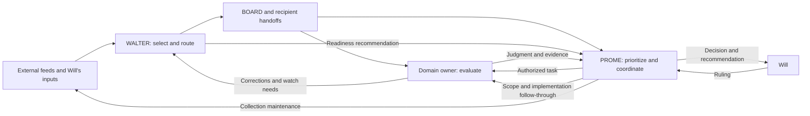

# WALTER and PROME — how the partnership works

October 2, 2026 · CATO · requested by Will for system direction.

**Current assessment, October 3 late:** WALTER's two commits are on freshly fetched origin and the 23-path boot-basis check matches. PROME transcribed the self-attestation, but its October 4 date violates the registry's ET basis for an October 3 filing; correcting it to October 3 still passes the existing freshness function. Reconcile stale boot carries and the surviving false STOP-ratification claim in one bounded owner pass. Installed CLI is already 2.1.289; its release notes support narrower permission/plugin changes than WALTER's general protection and fleet-visibility inference. No new configuration, audit, integration or collection commissioned. [Latest assessment](#october-3-late--re-attestation-and-claude-code-21289) supersedes prior READS/boot-basis and memory-header dispositions; earlier findings retain their stated limits.

**Keep the division of responsibility. Improve the handoffs that turn a collected item into a timely owner judgment.** WALTER supplies selected evidence and detects receiving desks that need attention. PROME allocates work, checks owner returns, preserves approvals and presents decisions to Will. The design can reduce Will's coordination burden, and a recent BRENT session demonstrates that mechanism. Its reliability is uneven: collection, filtering, recipient availability and decision pickup run on separate clocks, and good delivery records do not establish that the evidence was used in time.

This is an analysis and recommendation, not an implementation assignment. No owner files, collection schedules, routing rules or approval policies were changed. No agents launched or messages sent. The forecast pilot remains approved and untriggered.

## Evidence and limits

Read the relevant owner instructions, delivery/filter specifications, PROME boot and orchestration rules, current completion/handoff records, selected code and September 30–October 2 packets and ledgers. Started from shared HEAD `7e69c1e4a`; evidence snapshot for this report is `49e0ef1b2bf908796b56090d1387b58edcd10721`. Concurrent owners committed during inspection. Checked the intervening changes to the sampled WALTER logs: additions did not alter the October 1 rows used below. Clean Git observations do not establish idle owners.

This is a bounded relationship review, not a fleet census, an operational boot, a fresh market assessment or a new acceptance read of an owner's repair. Static code inspection and cross-checks at recipient artifacts establish only the stated scope. Collector deployment and its independent reviews are PROME-reported; neither the remote deployment nor its first production run was reverified. Financial claims in packets are described as examples of workflow, not independently recertified facts. Prior CATO intake/scanner work is author follow-up, not newly independent validation. No net time saving, trading edge or fleet-wide miss rate is established.

## The operating relationship

| Stage | WALTER's job | PROME's job | Evidence that the handoff worked |
|---|---|---|---|
| Collection | Consume Research-Intake; inspect Will's drops and returned research; expose degraded feeds | Maintain the collection lane and land tested source/query changes | Healthy retrieval evidence and a batch available to WALTER, not merely a successful scheduled job |
| Selection | Verify enough to frame a claim; assess novelty, relevance and credibility; identify domain and urgency | Supply current priorities through shared decision, position and catalyst records; resolve scope/authority questions | A signal with source limits and the correct ACTION/INFO recipients, or a reasoned kill |
| Delivery | Publish BOARD evidence and required recipient handoffs; maintain route/delivery records and corrections | Read the committed BOARD diff; receive operational packets at `PROME/inbox/` | Publication and delivery recorded separately; a direct ask reaches its owner |
| Mobilization | Identify unavailable recipients and recommend attention under the existing doorbell rule | Check presence and authority; launch/re-ping bounded owner work or seek a new-direction ruling | An authorized task with a named owner and deliverable |
| Judgment | Preserve provenance and route corrections; do not take over domain grading | Verify the owner's return, register resulting work/decisions, synthesize for Will | Owner judgment and current artifacts; a disposition that reaches its decision consumer |
| Follow-through | Keep outstanding delivery/readiness and Will-actionable items visible | Carry dated obligations, approvals, implementation confirmation and spawned-desk closeout | Closed loop or explicit remaining obligation, not a filed packet alone |

Sources: `AGENTS/WALTER/CLAUDE.md` identity and steps 7d–9b/11; `PROME/BOOT.md` steps 3b/6 and news-routing module; `PROME/CLAUDE.md` identity and Ask First; `PROME/ORCHESTRATION_PLAYBOOK.md` two-tier model. `PROME/ROSTER.md` owns fleet membership/cadence; WALTER's registry owns routing/delivery information. Those are complementary records, not two competing rosters of authority.

This is a feedback loop, not simply WALTER handing a news digest to PROME. Domain owners tell WALTER what to watch and correct its framing. WALTER tests whether the searches and phrases can find those events. PROME turns that evidence into lane changes and work assignments. Will also supplies inputs directly and launches sessions; neither agent is autonomous end to end.

PROME deliberately avoids duplicating every information-only handoff. It scans BOARD and ordinarily receives no duplicate WALTER inbox copy for INFO-only dispatches. An ACTION ask still receives the fail-safe handoff. Operational notes remain a separate packet channel. This is a sensible attention-saving boundary, conditional on the scanner working and the ACTION metadata being accurate. Sources: `BOARD_CONSUMPTION_SPEC.md` §§3.5, 3.5.1, 3.5.4 and 3.5.8(a).

## What the evidence shows working

**A WALTER recommendation can produce useful owner work without another permission cycle.** PROME's October 1 BRENT touch explicitly cites WALTER's report of an unavailable desk with energy ACTION items. PROME launched it at 13:17 ET under existing Tier-1 authority. BRENT's return records primary-source checks, thirteen inbox dispositions, registration of an already-approved prediction and correction of its position record. Its substantive result was “nothing fires”: news significance did not get mistaken for a registered trade condition. PROME's orchestration row also records the closeout ask and answer, while preserving the outstanding settle-window work. Evidence: `PROME/state/ORCH_LOG.tsv` BRENT October 1 row; `PROME/inbox/processed/2026-10-01_from-BRENT_L0-drain-phase1-nothing-fires.md`. This demonstrates a useful handoff, not a measured return on the whole system.

**The producer/consumer split supports corrective challenge.** WALTER tested PROME's proposed search queries and found combined OR expressions returning fewer useful items than separate legs, including a missing Egan-Jones leg. It also refuted PROME's claim that the leading recency operator was ineffective. The owner supplied measured counterexamples before PROME landed changes. Evidence: `PROME/inbox/processed/2026-10-01_from-WALTER_lane-queries-A-E-sizing.md`; PROME's October 1 afternoon HANDOFF entry acknowledges the correction. The search measurements are WALTER's, not replicated here.

**The records permit a distinction between delivery and later use.** Diesel signal `SIG-W-20261001-026` was routed to BRENT at 20:47:24Z on October 1. BRENT's `board_log.tsv` records action at 08:36:47 EDT on October 2 and the handoff is in its processed lane. The owner checked the registered rule and recorded that it had not fired. By contrast, mortgage signal `-025` remained in HOMER's pending lane with no matching row in the inspected `board_log.tsv`. That is evidence of different recorded consumption states, not proof of a harmful delay or that HOMER never saw the information elsewhere. Sources: the two recipient handoffs, recipient ledgers and WALTER's delivery log. Do not infer average latency from this pair.

## Consequential constraints

### WP1 — high priority: information can disappear before routing begins

The earlier intake review established that ordinary `NEW` news is omitted from WALTER's generated worklist; the current `intake_scan.py` news branch still handles alerts, watch classes and known-entity developments without ordinary NEW. This is narrower than claiming a desk without watch phrases receives nothing. WALTER also found two historical batches with zero **saved** Google-source items while the producer reported healthy. Saved output does not prove zero successful retrieval, and the historical cause remains unknown.

PROME reports per-leg counters deployed as Research-Intake `429f948`; the acceptance record preserves an unresolved, pre-existing write-order failure in which seen-state can advance before output is saved. That repair is already registered as L570. More routing discipline cannot recover material that was never collected or never surfaced.

**Recommended action:** finish that existing repair and inspect a production batch with demonstrated healthy retrieval, then use the previously proposed one-batch coverage comparison to separate useful unsurfaced candidates from duplicates and noise. **Owners:** PROME for producer, WALTER for consumer/triage. **Closure:** healthy/degraded retrieval is visible at the consumer, retries preserve output, and the bounded comparison establishes whether ordinary NEW review adds enough useful evidence to justify its cost. It does not authorize a permanent new review routine.

Evidence: CATO's `2026-10-01_1400_walter-intake-direction.md` WI1/WI4; WALTER's `research/2026-10-01_intake-bounded-comparison.md`; `intake_scan.py` news branch; `PROME/tools/tests/ACCEPTANCE_newsweep_leg_counters_L569.md`; DOCKET L569/L570. The counters diagnose future failures; their installation alone does not establish collection reliability.

### WP2 — high priority: WALTER's relevance judgments depend on context it reports skipping

`FILTER_SPEC.md` Boot Context requires scoped owner-state, position-mirror, catalyst and recent-disposition reads. These supply the meaning of “new,” “relevant” and “already known.” WALTER's latest saved completion explicitly reports those reads skipped for a sixth consecutive session. That is a consequential execution gap, not evidence that every dispatch was wrong. Manual verification and Will-supplied context may compensate, but the report does not establish equivalent coverage.

**Recommended action:** WALTER should restore the existing scoped reads at its next authorized session and state any remaining gaps. If the workload makes them impractical, bring a concrete reduction to the owner process rather than silently treating them as optional. **Closure:** evidence that the required context was consulted before filtering, or an explicitly approved replacement with its coverage limits. Adding a reminder would not solve a consciously skipped step.

Evidence: `AGENTS/WALTER/design/FILTER_SPEC.md:9` and `AGENTS/WALTER/LAST_COMPLETION.md` STATUS/GAPS. This is owner-reported execution evidence, not a replay of six sessions.

### WP3 — medium priority: several independent clocks govern responsiveness

Collection can be scheduled while WALTER still needs a session to consume it. A recipient can remain unavailable after dispatch. PROME can receive an owner answer yet wait for another decision-publication cycle. The roster explicitly labels WALTER DAILY while explaining that it is Will-launched and cannot self-wake. Increasing collector frequency alone therefore cannot guarantee faster owner judgment.

There are already two complementary mobilization paths: WALTER's event/readiness recommendation and PROME's dated-obligation driver. The latter is important because a registered due task does not need a fresh WALTER signal to become actionable. PROME also has aged-ACTION and aged-waits grants, with their existing limits. The October 1 Decision Deck record supplies a separate example: six answers waited roughly 3.5 hours for the next pickup. L580 now registers that issue; it is not a new CATO proposal.

**Recommended action:** judge the next timing change by the bottleneck it actually removes: retrieval, WALTER triage, owner availability or ruling pickup. Start with the existing work and recorded handoffs, not another dashboard. **Closure:** a time-sensitive example reaches a verified owner disposition before its named usefulness deadline. Nothing in this sample proves that an additional daily session or faster collection is the best marginal purchase.

Evidence: `PROME/ROSTER.md` WALTER cadence row; `PROME/CLAUDE.md` Ask First; `MESSAGING/CROSS_SESSION_MESSAGING.md` rule 6b; `PROME/HANDOFF.md` October 1 late entry. WQ-348 C7 now permits PROME's bounded free-feed/schedule changes; the older “needs Will's word” descriptions must not be used to request that same authority again. WALTER launch/cadence authority is a separate question.

### WP4 — medium priority: readiness records need a defensible reason for not escalating

The October 1 doorbell rows for HOMER `-025` and BRENT `-026` record L3b failing with “PRIORITY; cadence not the deadline,” without a p75/dark-duration basis. The governing cadence limb tests dark duration against the desk's own p75 gap; signal precedence is not that test. Recent desk activity may make the non-escalation correct—BRENT had closed out that afternoon—but these rows do not demonstrate it. This review did not recompute desk histories or establish an eligible missed doorbell.

**Recommended action:** on the next normal readiness pass, WALTER should use the existing cadence basis or explicitly mark it not computable; PROME should distinguish “no demonstrated reason to wake” from “tested and not due.” **Closure:** the sampled non-escalation can be reproduced from the rule's inputs. No new gate, blanket waking or retrospective fleet audit is recommended.

Evidence: `AGENTS/WALTER/registry/DOORBELL_LOG.tsv` the two signal/desk rows; `BOARD_CONSUMPTION_SPEC.md` §3.5.7; messaging rule 6b. Material consequence is uncertainty about the selection process, not a proven research miss.

### WP5 — medium priority: PROME's information-only exemption depends on an incompletely repaired scanner

The scanner now reads committed BOARD files and keeps a per-file/blob record, addressing the old unfinished-draft and late-lower-ID problems. Static inspection agrees with that design. Its acceptance record still lists consequential residual cases and three operating restrictions. WALTER has since confirmed committed publication and says changed asks must be new signals; that narrows normal exposure to in-place ask changes but does not independently close the code defects. Owner confirmation also supersedes the acceptance file's earlier “publication semantics unconfirmed” caveat.

**Recommended action:** complete WQ-350's already-authorized bounded repair/read in its permitted process slot; retain the operating restrictions until disposition. **Owner:** PROME, with WALTER defining publication behavior. **Closure:** acceptance file updated with the named reader's result and honest residual limits. Do not treat more review rounds or a green scanner as proof every relevant signal reached a decision.

Evidence: `PROME/tools/board_scan.py`; `PROME/tools/tests/ACCEPTANCE_board_scan_publication_2026-09-30.md`; `PROME/inbox/processed/2026-10-01_from-WALTER_board-scan-publication-answers.md`; DOCKET L562/WQ-350. This report adds no repair verification round.

## Direction for Will

Retain WALTER's editorial judgment and PROME's control of work allocation. Giving WALTER broad launch authority or making PROME triage every raw headline would add responsibility without first resolving the observed handoff failures. Both agents already have substantial mechanisms; the immediate opportunity is dependable execution and completion of existing repairs.

After due decision work, prioritize the producer/consumer repair and healthy-batch observation, restore WALTER's relevance context, and finish the approved scanner and pickup work within their existing sequencing limits. Use an existing time-sensitive signal as the practical test: what changed, who evaluated it, when, and what decision did it affect? A reasoned “nothing changes” is a useful outcome. A delivered file alone is not.

For a next discussion, the central design choice is **how much of discovery Will wants the system to perform without his screenshots and manual launches**. The current design assists that work but does not demonstrate dependable independent coverage. Set that desired service before considering more feeds, frequency or autonomy. No new ruling is requested by this report, and no implementation begins on its advice alone.

## Side investigation — direct X intake

Will asked during this review whether WALTER could have an X login, receive the news notifications he sees on his phone, and act on relevant items. **The collection-and-triage workflow is feasible; exact reproduction of his personalized notification feed is not established.** “Act” here means verify, classify, record and route research through existing authority, not publish from the account or execute trades.

Anthropic documents that Claude Code's Chrome integration shares the browser's authenticated state, can extract page content, and pauses for manual login/CAPTCHA handling. Its documented long-session connection failures make access different from unattended reliability. It also does not support WSL; this review did not inspect Will's installation or establish its browser compatibility. X's automation rules prohibit non-API website automation, so the proposed durable path is the official API rather than an unattended browser reading the account. [Claude Code Chrome documentation](https://code.claude.com/docs/en/chrome); [X automation rules](https://help.x.com/en/rules-and-policies/x-automation).

X's Filtered Stream currently supports account and keyword rules, near-real-time delivery, and pay-per-use access. An explicit set of news accounts can therefore feed a collector independently of phone notifications. That does not establish access to X's personalized recommendation/notification selection, private posts or every media item's complete content. **Will clarified that his useful notifications are a mixture of selected-account alerts and X recommendations.** A selected-account feed would replace only part of his discovery; the recommendation component may find unfamiliar accounts/topics and must be evaluated separately. [X Filtered Stream documentation](https://docs.x.com/x-api/posts/filtered-stream/introduction).

Published pricing checked October 2 is **$0.005 per post read**: 1,000 posts would be $5 in post-read charges, excluding additional resources, model use and hosting. Actual developer-account access and costs have not been tested; prices can change. A narrow source list makes spend and review volume easier to bound. [X pricing](https://docs.x.com/x-api/getting-started/pricing).

**Proposed fit:** an X collector supplies the existing intake architecture with post identity, author, publication/collection times, text and source/media links; WALTER deduplicates and verifies consequential candidates; normal BOARD/recipient paths carry the result; PROME manages owner attention. Preserve source content as evidence, never as executable instructions. Collecting while WALTER is absent requires durable queuing and visible collection failures. A separate, explicitly authorized wake/triage arrangement is needed for prompt response; a feed by itself does not confer launch authority or create an always-on WALTER.

**Suggested first decision, not an approved build:** cost a narrow account-source feed and compare its coverage against examples from BOTH kinds of useful notification. Keep recommendation-originated discoveries visible through the existing manual input path while their automated equivalent remains unestablished. Expanding keyword rules can be tested for discovery, but is not evidence of reproducing X's recommender. Judge incremental useful evidence, delay and attention saved, not total posts collected. This could reduce manual forwarding, but its value is not demonstrated yet. No account was accessed, credential requested, app installed, subscription purchased, collector built or wake mechanism enabled.

## October 3 bookmark follow-up and session close

Will relayed successive WALTER pilot updates and requested CATO's feedback and implementation status. The bookmark channel recovered concrete leads, but its net benefit and whole-stream filtering quality remain unproven. Two recovered image-based items establish a retrieval/triage failure mode, not its frequency or their ultimate research value. Post-creation dates do not establish bookmark dates; no-dispatch does not establish healthy filtering.

Standing advice: classify financial research, system-improvement candidates and personal/no-action separately from assessment status; attempt plausible media/link content before rejecting; retain inaccessible/unread items as not-assessed; preserve stable IDs; dispatch according to consequence. NOTE is non-actionable-only and un-instrumented, not a substitute for tracked asks. Keep bookmarking easy for Will. Attribute the dated JPM forecasts to the note and the insurer analysis to MISPRICED ASSETS/Wyandanch, with one of 23 pages read; neither is independently verified current fact.

Earlier artifact inspection through `633a83fcf` confirmed the two leads' caveats and concrete owner questions: JPM `-009` to BRENT, FALCON/CRUISE info; insurer `-010` to SHADE, BROCK info. At that inspection, the production fetcher still requested author/post metadata without media/link expansions, while expanded retrieval had been done with scratch scripts. Durable method and test records were then incomplete.

In Will's latest relayed update, WALTER reports preserving the method in `design/X_BOOKMARKS_ACCEPTANCE.md` section 9, dispositions in `research/2026-10-03_x-bookmark-backlog-triage.md`, and a memory pointer; reconciling the narrow live expired-token success in section 8; and updating LAST_COMPLETION with a passing closeout receipt. Refresh failure, seed-failure and 429/network failure paths remain unobserved live. Those latest edits are owner-reported, not a fresh CATO artifact audit. WALTER explicitly leaves production media/link expansion undone as a separate task.

At that update, latest commits were local and delivery still pending. CATO advised coordinating PROME's push, verifying arrival and finishing closeout. During CATO's own closeout, shared history at `723b98800` contains `a429ef660` (WALTER closeout breadcrumb) and `c48a62d47` (delivery-log reconciliation claiming all 11 rows delivered via PROME's train). Those subjects update the resume pointer; CATO has not re-audited receipt contents or owner consumption. Do not preserve the earlier local-only claim as current fact.

Next useful work, if assigned: bounded production media/link fetch change before larger slice tooling. Hold further backlog processing pending direction and seek BRENT/SHADE dispositions (adds evidence, contradicts, duplicates) before claiming research benefit. CATO has not commissioned work, sent packets, launched recipients or edited WALTER. Discussion of DAEDALUS on Codex/Astra supplied a command and explicit instruction-reading prompt only; no CATO migration or launch occurred. Prior forecast-pilot authorization survives but was not triggered by this discussion or closeout.

### Session-close verification

Only CATO continuity and these two continuing reports are changed for this closeout. No code tests are needed for disposition-only edits. Foreign PROME/DAEDALUS/script changes are active shared work and remain untouched; no pull performed. Required check results follow below; delivery receipt belongs in-session.

Weekday check passed after verifying all six inputs readable: `PROME/DOCKET.tsv`, `PROME/GATES.tsv`, `PROME/WILL_QUEUE.md`, `AGENTS/CATO/CONTINUITY.md`, this report, and `AGENTS/CATO/runs/2026-10-03_1438_helm-split-review/README.md`. Optional CATO STATUS/calendar/catalyst files remain absent. Direct startup sizes: CATO AGENTS 6,465 B, CHARTER 9,921 B, CONTINUITY 8,456 B; root CLAUDE 24,199 B, USER 4,626 B, AGENTS 4,991 B. All readable and below 32,550 B. Generic read-cap check returned rc 2, CANNOT-EVALUATE for the absent local CLAUDE.md; the checker itself has concurrent DAEDALUS edits, and this result is not a pass. Orphan advisory found foreign working files only, no CATO-authored external packet. Whole-tree whitespace check flags foreign PROME ORCH_LOG trailing tabs; leave owner data untouched and scope CATO's final whitespace check to its three paths. No ledger-nudge, memory-index or consumer-figure condition triggered. No retirement is due for CATO's files, established less than 60 days ago.

## October 3 system-improvement handoff review

Will requested CATO involvement in WALTER's system-improvement/backlog thread. Current recommendation: stop broad tail processing on opportunity cost, preserve unread material, and evaluate only a small number of candidates against actual failures. The report has reached its consumers; evaluation and adoption remain separate. No WALTER/PROME/DAEDALUS files, configuration or token stores changed; no messages, canary run, collection or agent launch.

### WP6 — financial coverage overclaim (medium)

WALTER's relayed summary says the backlog is fully reviewed and nothing remains to extract. Its durable `research/2026-10-03_x-bookmark-backlog-triage.md` instead marks approximately 151–287 unprocessed, financial videos #64/#76/#86 not-assessed, and link #85 assessable but not yet assessed. Its system-improvement report describes a system/process pass over 299 bookmarks and says financial posts were almost certainly absorbed. Those are different review scopes. Older post dates do not establish when Will bookmarked them or that a desk already used them. No new financial source assessment occurred in this CATO pass.

**Advice:** WQ-377(b) STOP is reasonable after two empty financial slices and an apparently low-yield tail, but preserve it as an economic stop with incomplete coverage. Do not translate unread items into rejected items or claim exhaustiveness. The current working WQ-377 row already corrects this distinction and retains Will's last instruction to continue; CATO recommends a new stop ruling, not treating WALTER's recommendation as that ruling. Closure: WALTER's final summary/disposition agrees with this limited coverage and the unread set remains reachable. No exhaustive replay required.

### WP7 — security proposal and summary diverge (medium)

The relayed WALTER text says install the deny rule only if a canary reproduces unprompted reads. Actual WQ-380 recommends installation **whatever** the test finds. That is materially different approval scope; no ruling is inferred here. The social post's unprompted-read claim remains unverified, and a single negative startup test would establish only that run's behavior. Gitignore evidence concerns Git handling, not model access; CATO did not inspect token contents or certify their history.

Anthropic's [permissions documentation](https://code.claude.com/docs/en/permissions#read-and-edit) says Read denies cover built-in file tools and recognized shell file commands, but not arbitrary Python/Node subprocess reads. Thus a deny can reduce accidental exposure without creating a complete secret boundary. [Settings documentation](https://code.claude.com/docs/en/settings#where-claude-code-looks-for-each-file) also makes launch-directory/configuration scope relevant. Installed CLI reports 2.1.288; effective settings and behavior were not tested.

**Advice:** narrow the next authorization to harmless-canary verification and a concrete configuration proposal. Test blocked direct reads, applicable indirect paths, actual desk launch directories, and continued operation of the intended token-using scanner without printing credentials. State residual access explicitly; do not equate the scanner retaining Python access with proving arbitrary Python cannot disclose the same file. Then approve the demonstrated protection and exact scope. No fleet configuration copy or OS sandbox redesign is commissioned by this review. Closure: WQ and operator summary describe the same proposal, with tested protection and limits. The decisive uncertainty is protection achieved, not whether the alarming post happens to reproduce once.

### WP8 — candidate claims are outrunning their evidence (medium for the token inference)

The report correctly labels its sources as posts/thumbnails/expanded links, not the underlying talks/repos. But its packet says the posts directly quantify our cost structure and calls prompt caching a read-cap/charter remedy. Anthropic documents [caching as a cost/latency optimization](https://platform.claude.com/docs/en/build-with-claude/prompt-caching); [cached tokens still occupy context](https://platform.claude.com/docs/en/build-with-claude/context-windows). The small uncached `input_tokens` field is not total input. Therefore the reported 108k-to-11 claim is not evidence of a comparable context reduction, and cached large instructions do not fix a file-read truncation limit. Actual request/cost metrics are needed before recommending a harness-specific optimization.

The sampled disk sizes are WALTER CLAUDE 65,767 B + root CLAUDE 24,199 B + memory/auto/MEMORY 17,937 B = 107,903 B. This substantiates the approximate sum of those files only: not a token count, measured runtime injection, fleet-wide boot size, wasted fraction or caching saving. No actual model request was inspected. Also, a similar supervisor/specialist topology in the JPMorgan post is an analogy, not evidence our implementation is institutionally validated or efficient.

**Advice:** DAEDALUS's L603 pass should first retrieve the underlying primary resource and test relevance. Select one or two candidates that address known failures; defer broad reading lists. A document-converter candidate should be compared on a document WALTER actually mishandled, against the existing extraction route, before adopting it. Carry stable post IDs/direct links because bookmark ordinals shift. Keep process improvement candidates, hypotheses and demonstrated benefits distinct. Closure: claims retain attribution and any proposed adoption names a concrete advantage over current tooling, demonstrated on an applicable case. No quantitative token or accuracy improvement is accepted from these posts alone.

### Handoff, scheduling and publication observations

The WALTER report and two packets exist at `50f81979c`/`fbdbd4096`; PROME's processed coordination packet and `38275130e` establish consumption and registration of L603/WQ-380. L603 targets October 12 and expressly protects L490/L594 through an October 5 scope check. That scope check matters: October 12 already holds eleven profile refreshes and other work, so registration alone does not establish spare capacity. Accept deferral as a valid evaluation disposition rather than turning all candidates into builds.

The same coordinator commit supplies DAEDALUS's previously missing handoff receipt and L604 for slate B1/B2. This updates DC1's delivery evidence; acceptance and scheduling dispositions remain due October 5. See the brief follow-up in CATO's continuing DAEDALUS report. No new code review triggered.

WALTER's push deferral has a real desk-specific basis: BOARD_CONSUMPTION_SPEC section 7 requires Will-coordinated pushing outside the narrow urgent exception. Do not tell it to ignore that. But a dirty shared tree is a pull hazard, not itself a reason an authorized safe-push would overwrite working files. Fresh publication ancestry, not counts of purported pending commits, determines delivery. CATO fetched origin without pulling and checks the relevant commits below; do not preserve a stale local-only claim after confirmation.

WQ-377 remains three separable decisions: stop the backlog, expand production retrieval, and wire the scan at boot. Support prioritizing the existing bounded media/link fetch change before relying routinely on the boot lane. Boot wiring runs on WALTER launch and does not by itself provide unattended coverage. The prior live token-refresh success and untested failure legs remain recorded in X_BOOKMARKS_ACCEPTANCE sections 8/9; no new live reliability claim.

### Follow-up verification and stop condition

Read the WALTER report, triage record, two packets, relevant acceptance sections and push authority; selected current WQ-377/380 and DOCKET L490/530/538/603/604 rows; DAEDALUS handoff and receipt commit; official Anthropic documentation. Snapshot began at `c5cd19407ee48490ee081870d51102b46881c45b`. PROME has active uncommitted rotations; current WQ-377's 17:5x correction is working-tree evidence and may change. DAEDALUS started scorecard files during this review; no assessment of in-flight output. No full underlying bookmark-source review, settings test, secret read, code edit, consumer-result audit or new broad sweep. Existing decision records are the handoff destination if Will chooses further work. Stop after delivering these bounded corrections; no approval to implement or send follows from the review.

Checks: fresh-fetch ancestry confirmed all four named commits (`50f81979c`, `fbdbd4096`, `38275130e`, `c5cd19407`), each rc=0; the report/packets are therefore already published, superseding the relayed local-only claim. Weekday rc=0 after reading all six checked paths: PROME DOCKET, GATES, WILL_QUEUE; CATO CONTINUITY; this report; DAEDALUS catch-up report. Direct startup bytes: CATO AGENTS 6,465, CHARTER 9,921, CONTINUITY 9,025; root CLAUDE 24,199, USER 4,626, AGENTS 4,991. All below cap. Generic CATO read-cap rc=2 CANNOT-EVALUATE for missing local CLAUDE, not a pass. Orphan advisory lists active foreign DAEDALUS/PROME/memory work; none authored by CATO here and all preserved. Exact three CATO paths pass whitespace check. Index was empty at the initial check; three DAEDALUS scorecard paths were staged concurrently before commit and excluded by CATO's exact pathspec. Resulting CATO commit paths were inspected. No code tests needed; no ledger, memory or superseded-domain-figure trigger. Final receipt in-session.

## Original October 2 verification and delivery

Repository evidence review and static inspection; official public documentation browsed for the X side question. No operational gates, scanner advancement, collection, remote market/deployment verification, private-store reads or owner edits. Report and CATO continuity are the only intended delivery paths. Check results and publication receipt recorded at closeout below/in-session.

Closeout checks: orphan advisory clean; tracked and new-report diff whitespace clean. Weekday check passed after verifying all five actual inputs readable: `PROME/DOCKET.tsv`, `PROME/GATES.tsv`, `PROME/WILL_QUEUE.md`, `AGENTS/CATO/CONTINUITY.md`, and this report; repeated after Will's mixed-notification clarification. CATO has no optional STATUS/calendar/catalyst input. Direct startup byte measurements: CATO AGENTS 6,465; CHARTER 9,921; CONTINUITY 4,460 (rechecked after clarification); root CLAUDE 24,236; USER 4,626; AGENTS 4,991. All six readable and below 32,550 bytes. Generic `read_cap_check.py --agent CATO` returned rc 2, CANNOT-EVALUATE because there is no local CLAUDE.md; this is not a pass. No ledger, auto-memory or domain figure was changed, so their conditional checks do not apply. No code changed; no new tests were needed. Final path inspection and fresh-fetch push receipt belong in-session.

## October 3 closeout follow-up — 18:23 ET

Will asked whether WALTER had anything left to do after its Tier-2 closeout. Inspected `ef91182cd`, current LAST_COMPLETION, the changed method paragraph, local MEMORY header and byte count, relevant charter closeout rules, WQ-377/380, and the existing HANS packet. This is a narrow follow-up to WP6–WP8; no repeat delivery-log audit, doctor run, collection, configuration test or owner edit. Shared PROME/DAEDALUS work remains active.

**WP6 persists and has propagated:** LAST_COMPLETION STATUS/RESULT, STATUS, MEMORY and SESSION_LOG claim all 299 reviewed/backlog complete, while the underlying financial triage still carries unread/unprocessed material. WALTER reports Will ratified STOP; the current PROME WQ-377(b) still presents STOP as a recommendation awaiting a choice. A ruling can exist in the other session: do not infer it never happened. Preserve its exact source/time and have the coordinator reconcile that part of the existing row. No renewed permission needed if already granted. Correct coverage to financial triage through item 150 plus a system-lens pass over 299; retain the remaining unassessed set. A decision to stop does not require assessing it.

**New WP6 instance in acceptance section 9:** the closeout adds a general two-zero-route stopping rule and says a zero-route slice is a filter-health result. This session's earlier slice-2 false dismissal is a concrete counterexample to zero routes proving good filtering. Keep the observed yields and a case-specific diminishing-returns recommendation; do not promote them into a universal quality test or stopping policy without justification and applicable authority. Correction should travel to active summaries/method/memory, preserving dated history.

**WP9 — due local-memory maintenance (low operational severity; unfinished closeout step):** WALTER MEMORY measures 24,796 B; its explicit header says rotate above 24,412 B, and charter Tier-2 step 14 requires pruning above 100 lines (current file reports 116). It remains under the root 32,550-byte hard budget: no current truncation alleged. Deferring to avoid rushed work does not itself satisfy the triggered owner obligation. Recommend a bounded, content-preserving cleanup under WALTER's existing promotion/conservation method, then measure and run applicable checks. This is WALTER's local MEMORY.md, not an instruction to compact fleet auto-memory. Closure: due maintenance performed with content preserved, or an explicit authorized exception recorded; never restamp as clean.

READS and boot_basis remain UNKNOWN/review-required by WALTER's own closeout. Keep them explicit and refresh after the actual required source review before relying on the next boot's certification; no blind timestamp refresh. Their staleness is not proof the dispatch was wrong, and 4 MED / 0 HIGH does not independently establish completion. HANS remedy is already requested by `AGENTS/HANS/inbox/2026-10-02_from-WALTER_THRESHOLDS-tsv-over-read-budget.md`; leave the owner's remedy pending without duplicate dispatch or foreign edit. Media/link expansion, boot wiring and the security proposal remain separately gated work, not tasks silently added to this closeout.

The closeout commit was one ahead of origin at first inspection. WALTER's local charter explicitly defers its push on observed foreign dirty work; respect that desk-specific instruction. CATO's own required publication may carry the already-committed closeout on the shared train, with receipt in-session. No claim that an unspecified next sync automatically publishes it.

Follow-up checks: weekday rc=0 on five readable paths (PROME DOCKET/GATES/WILL_QUEUE, CATO CONTINUITY and this report); own-path whitespace clean. Startup bytes: CATO AGENTS 6,465 / CHARTER 9,921 / CONTINUITY 9,673; root CLAUDE 24,199 / USER 4,626 / AGENTS 4,991, all below cap. Generic CATO read-cap rc=2 for missing local CLAUDE, not a pass. Orphan advisory identified foreign DAEDALUS build/review files and PROME argus_baseline; preserved. Index empty at inspection; exact-path commit excludes concurrent work. No code, memory-auto, STATUS-ledger or superseded-figure check trigger. Final publication receipt in-session.

### Verification of WALTER correction f452d9d9d

Will relayed WALTER's correction/closeout and asked whether it was fixed. Bounded artifact check: the method paragraph now rejects automatic two-zero stopping and zero-route self-certification; STATUS and principal LAST_COMPLETION/triage passages distinguish financial coverage through 150 from the system-lens pass and withdraw the supposed Will ruling. No resumed collection is needed to accept those corrections.

WP6 remains open only for propagation: boot-read `MEMORY.md:97` still says Will ratified STOP and WQ-377(b) settled; LAST_COMPLETION line 46 still says backlog CLOSED. Memory header line 10 and LAST_COMPLETION GAPS line 27/JSON owed list still claim rotation due/deferred despite the new addendum. These are active consumer instructions, not labelled history. Reconcile them in one owner pass; no broad re-audit.

WP9 byte cleanup is verified: MEMORY now 23,489 B, below 24,412. Compared f452d9d9d parent MEMORY with current MEMORY: all 11 removed nonblank lines occur in MEMORY_PROMOTED. This confirms removed-line preservation, not a fresh run of the owner's full conservation harness. MEMORY remains 106 lines against charter step 14's >100 cleanup condition; finish that small residue without deleting evidence. Existing READS/boot_basis and HANS obligations remain separate.

Fresh fetch succeeded; individual ancestor checks for f452d9d9d and 153cb690e returned rc=0, so pending-push wording is overtaken. Review snapshot HEAD ddb388ced; DAEDALUS GATE_LOG and PROME argus_baseline dirty, preserved. No owner edits, sends, new tests or operations. Stop when the named active contradictions and line-count residue are reconciled; the substantive repairs do not need reopening.

Verification closeout: five readable weekday inputs passed (PROME DOCKET/GATES/WILL_QUEUE, CATO CONTINUITY and this report); exact-path whitespace clean; index empty at inspection. Startup bytes CATO AGENTS/CHARTER/CONTINUITY 6,465/9,921/9,864; root CLAUDE/USER/AGENTS 24,199/4,626/4,991, all under cap. Generic CATO read-cap remains rc=2 CANNOT-EVALUATE for absent local CLAUDE. Orphan advisory's remaining foreign PROME argus_baseline preserved; no CATO-authored external paths. No new conditional ledger/memory/consumer check trigger. Publication receipt in-session.

## October 3 data-feed inventory and PROME trials

Will relayed a further data-tools assessment, then requested a read of PROME's four-candidate trial. Review began at `cdce62298`; shared HEAD advanced to `3ca46a1b4`. Read the relevant TERRY implementation/registry and historical chain-use receipt, DEWEY implementation, FORGE tool inventory, PROME's `reports/2026-10-03_system-improvement-candidates-primary-source-read.md`, WQ-379 proposal, current WQ-379/380 and applicable review-budget clauses. Official SEC, Financial Datasets pricing and Microsoft repository pages checked. This is advice on the evidence and proposed next work, not another acceptance read of WQ-379 fixes. No new market retrieval, paid trial, install, agent call, owner edit or send. PROME's reported PDF timings/output were not independently reproduced or checked against the source PDF; neither model answer establishes a deployed benefit.

### WP10 — “missing data” claims skip existing capabilities (medium)

- **Options:** `AGENTS/TERRY/scripts/chain_fetch.py` actually invokes yfinance option_chain and outputs bid/ask/IV/OI, with stale-data caveats. TERRY's tool registry carries it, and the processed September 22 PROME chain-recovery packet records use (44 rows). This is more than an unimplemented idea. `scripts/greeks.py` computes Black-Scholes Greeks with explicit European/flat-vol limits. Chain data omits vendor delta/theta; model estimates do not equal a current vendor-supplied Greeks feed. Nothing here certifies today's availability, executable prices or broker agreement. The useful hypothesis is better freshness/reliability/coverage and sourced Greeks, not acquiring the first chain or calculator. Identify the unnamed API, then have TERRY compare specific needed contracts, quote timestamps, entitlements, model conventions, broker agreement and cost. Keep the result in the existing evaluation; no new build merely because a bookmark says “free.”
- **Fundamentals:** `AGENTS/DEWEY/scripts/edgar_doc.py::xbrl_concept` and its `facts` CLI retrieve structured SEC company-concept values. The header's reference to `xbrl_facts(all=True)` is not implemented in this file; do not claim an existing full-companyfacts wrapper from its constant alone. [SEC's official APIs](https://www.sec.gov/search-filings/edgar-application-programming-interfaces) provide financial-statement XBRL without API keys, subject to taxonomy/entity/period limits. Thus “we have no programmatic fundamentals” is too broad. A commercial service may still improve normalization, coverage or retrieval effort; compare one bank and one hyperscaler on the exact periods and metrics the desk uses against filings and the existing SEC route. [Current vendor pricing](https://www.financialdatasets.ai/pricing) advertises $20/1,000 requests with one year of core history, or $200/month with longer history; use current terms instead of assuming the post's freemium/coverage claims. Vendor quality claims remain untested.

**Closure:** revise both gap statements and name a measurable improvement over the existing route before a paid-data/configuration decision. Identify the options vendor first; defer general cluster browsing and skill trials until a concrete task justifies them. Similar multi-agent shapes establish neither superiority nor redundancy without a task comparison.

### WP11 — useful suggestions promoted prematurely into process (medium)

PROME's MarkItDown comparison is the strongest evaluation: one real document, reported gain in table pairing and loss in prose, appropriately rejecting a blanket replacement. Retain that bounded conclusion. A targeted table pass remains a hypothesis, not a tested fix; validate labels, units, periods, values and prose against the original PDF if WALTER elects to pursue it. Microsoft confirms the [MCP package](https://github.com/microsoft/markitdown), but packaging is not the benefit.

The planning trial establishes that two calls produced potentially useful suggestions. It does not establish that the prompt improves decisions, is better than ordinary review, or merits “one Opus call per proposal.” Its wording presupposes that an addition is desirable. Prefer an occasional question allowing removal, simplification, or no change; retain it only when it changes a decision enough to earn its cost. An extra review/filed answer is recurring work even without a tool or charter edit. PROME's existing review-budget clause explicitly counts parallel readers and does not reset on a new label: account for the two calls and any future plan review within the applicable episode; do not infer a “habit” exemption. This pass does not adjudicate a past budget violation without the complete episode history.

The favored dormancy proposal needs item-level correction before Will rules it:
- L361 is explicitly recorded as recurring on October 3 in the proposal itself. It cannot be justified as a quiet defect awaiting evidence of recurrence.
- L431 can orphan the new reading while leaving the old reading current; this is a potentially silent data-integrity failure. Excluding only L366 does not establish the remainder is safely observable.
- “No symptom by October 25” does not demonstrate repair, supersession or even exposure to the triggering condition. Keep a deliberate accepted-risk deferral distinct from a resolved/tombstoned defect; name a feasible observation path and preserve evidence. Ten removals, retaining L366, explain 29→19; the short “ranks 19–29” formulation omits that exception.

Sonnet's outcome question is useful, but no recurrence over 14 days is not efficacy proof. Use an existing acceptance check/seeded counterexample and a relevant real opportunity where available; do not automatically lock all subsequent repairs behind a new receipt layer. Feedback can be added proportionally to existing evidence, not a fresh per-slot reporting system.

### Source grades, operator language and unresolved queue text

PROME labels the Cherny advice “primary reached” while expressly obtaining it through a secondary. Correct the grade to secondary attribution; the unverified percentages remain unverified. Byte totals and bytes/4 estimates are not measured prompt injection, and aggregate standing files are not a like-for-like comparison with one CLAUDE.md. The size concern already has a home; no new rule or queue required. “Only add a rule after an observed mistake” should be a pressure against bloat, not an absolute bar to explicit human constraints or preventive controls for foreseeable consequential failures.

The chief-of-staff story is an analogy, not validation of fleet performance. Trying dispatch/prep/yours/skip in one operator report is a reasonable prose experiment; labels must describe authority/state accurately (dispatch does not grant send authority, skip does not imply cancellation). No extra implementation needed.

WQ-380 still carries its broad shared-config proposal. PROME can correct factual descriptions of partial protection without making Will re-approve factual accuracy; adopting the settings remains a separate decision. Current row also labels “never committed” VERIFIED via git check-ignore, which establishes ignore behavior rather than history. This pass did not inspect secrets or certify their history. Narrow the claim or support it with appropriate history evidence. No new canary or secret test commissioned.

**Recommendation/stop:** retain the PDF result and optional one-report vocabulary trial; correct source/inventory/queue wording; keep the prompt and dormancy ideas as unproven, bounded options. Do not add a routine reviewer, waive ten obligations, or broaden October 12's workload on these results. Record returned advice and await Will; prior unrelated approvals survive untriggered.

Verification: weekday check passed on five verified-readable paths (PROME DOCKET/GATES/WILL_QUEUE, CATO CONTINUITY and this report). Direct startup bytes CATO AGENTS/CHARTER/CONTINUITY 6,465/9,921/10,359; root CLAUDE/USER/AGENTS 24,199/4,626/4,991, all below cap. Generic CATO read-cap rc=2 CANNOT-EVALUATE for absent local CLAUDE, not a pass. Orphan advisory identified only foreign PROME argus_baseline, preserved; index empty and exact two-path whitespace clean. No code tests needed for advice-only changes; no ledger/memory-index/consumer-figure trigger. Final commit and fresh-fetch receipt delivered in-session.

## October 3 late — re-attestation and Claude Code 2.1.289

Will supplied WALTER's re-attestation/closeout and changelog analysis for review while DAEDALUS works separately. Snapshot HEAD `89eb81946cacceab02e8b353ead0357d875bc05e`; active foreign DAEDALUS/PROME/shared edits preserved, no pull. Read WALTER's boot/closeout obligations relevant here, both commit diffs, packet and actual READS row, current MEMORY/LAST_COMPLETION, prior WP6/WP7/WP9 evidence, the checker implementation and official upstream release/type/permission documentation. No operational WALTER boot, market pull, secret/configuration read, agent launch, owner edit or send.

### What is established

Fresh `git fetch origin` succeeded after sandbox escalation; separate ancestry checks for `8f951a7da` and `d97013020` returned rc=0. The former updates twelve hashes and the memory header; the latter authors the re-attestation packet. PROME's `c858c6ba3` transcribes it at 21:54:13 ET October 3, and the packet is at `PROME/inbox/processed/2026-10-04_from-WALTER_READS-reattestation-0-9b.md`. WALTER's local directory has no outstanding changes at inspection. CATO reran `boot_basis_check.py`: **MATCH, 23 declared paths, execution not certified**, rc=0. That establishes byte agreement with the reviewed declaration; the substantive review of all twelve owner changes remains WALTER's attestation, not a second full CATO source audit.

`reads_check.py --agent WALTER` now recognizes the attestation and no longer reports stale-coverage UNKNOWN. It still returns **rc=1** for the known HANS whole-read breach: 33,544 B against 32,550. The 22 cap-bearing plus 28 declared-not-bearing rows are not 50 independently measured whole reads. Eleven oversized inputs are excluded by declared mode, as WALTER correctly disclosed; their legitimate narrow modes are not by themselves defects, and this pass did not re-enumerate all operations. The existing October 2 HANS packet is present: no duplicate flag or weekend launch justified.

WALTER's push deferral follows its explicit local charter/BOARD-spec exception, recognized by root. The explanation “a push would be unsafe” is too general: foreign dirty work blocks pulling, whereas the shared safe-push does not rewrite the working tree. Preserve the desk-specific instruction; do not rewrite fleet Git policy from this episode. Publication has now occurred, so no pending push remains for the two named commits.

### WP12 — attestation date uses the wrong clock (medium assurance; bounded correction)

READS header lines 12–13 explicitly define `declared_on` and filenames as **ET**. The row instead says October 4 while its own provenance says filed **21:54 ET October 3**, copying WALTER's boot clock. The packet explains choosing October 4 to postdate the October 3 basis change. The checker compares `newest > declared_on`; it does not require waiting until a later calendar day. A date cannot establish review of future changes.

CATO imported `PROME/tools/reads_check.py` read-only, constructed rows from the actual WALTER BASIS/ATTESTATION records, and called `attestation_stale` with two in-memory copies: October 4 → `(False, None)`; October 3 → `(False, None)`. No registry mutation. **Correction: WALTER supplies the actual October 3 ET review time/source pin; PROME corrects the attestation date/provenance, retaining the historical filing.** Use the normal owner path for any packet filename/pointer reconciliation. No repeat source audit is needed solely for the date correction. The existing hash checker already covers same-day/dirty-byte drift; this pass commissions no new clock/checker. No malicious intent or actual unreviewed change masked by the date is alleged.

### WP6 / WP9 — useful maintenance remains incompletely propagated

The memory header now says rotation DONE, so that previously stale header instance is closed. At current bytes MEMORY is **23,549 B / 106 lines**: below the byte trigger, still above charter Tier-2 step 14's 100-line cleanup condition. Conservation of the earlier rotation was already verified; do not repeat it without changed content or delete live caveats simply to hit the count.

The active records still contradict the new closeout:

- `MEMORY.md:97` says Will ratified STOP and WQ-377(b) is settled; current WQ-377(b) remains an open choice, and WALTER's own correction withdrew that ruling claim. Line 106 still carries READS/boot-basis as owed; lines 103/106 carry old publication/maintenance state.
- `LAST_COMPLETION.md:6,25,56,91` still says re-attestations owed; line 27 and JSON say memory rotation owed; line 46 still says backlog CLOSED; old pending-publication statements persist beside a newer addendum. Its leading prose already distinguishes incomplete financial coverage, so this is surviving propagation, not a wholly uncorrected report.

Recommend one owner reconciliation of current FOLLOW-UP/GAPS/JSON and MEMORY, preserving dated history and the unassessed financial tail. WALTER's charter requires current obligation reconciliation in both closeout tiers. The header's attribution “by walter-f0/CATO” should not imply CATO authored the rotation: CATO reviewed preservation; WALTER made it. No new collection or broader audit follows. Stop calling the entire desk “clean and current” until these specific contradictions are resolved or explicitly retained as historical-only. WP6 and WP9 keep their existing IDs.

### WP7 / WP13 — narrow the release interpretation before adopting anything

`claude --version` on this box reports **2.1.289**, already installed. This does not prove every pre-existing session has restarted onto that executable. The [official release entry](https://github.com/anthropics/claude-code/blob/main/CHANGELOG.md#21289) supports the named fixes, but its symlink change specifically concerns @-mentions and changed/selected IDE file context. It does not establish universal indirect-read protection. The same entry's `agent.spawn`/id/state additions are plugin-facing capabilities, not evidence that our fleet census now sees every session.

The [official permissions documentation](https://code.claude.com/docs/en/permissions#read-and-edit) says Read-deny enforcement includes built-in file tools and recognized shell file commands/redirections, but not every indirect access, including arbitrary Python/Node file reads. This preserves the partial-protection caveat; neither “Read-only tool protection” nor “all access fenced” is accurate. WQ-380 now correctly proposes a harmless-canary/concrete-proposal stage followed by approval of demonstrated scope; that earlier WP7 mismatch is closed. Its recorded installed version 2.1.288 is superseded by today's CLI observation. Its old `git check-ignore` → “never committed” inference remains unproven, as previously reported; this pass did not inspect secret contents or history.

The [published plugin type contract](https://github.com/anthropics/claude-code/blob/main/mods/types/claude-code.d.ts) describes `AgentInfo`/`$.agent.list()` as subagents and in-process teammates **of this session**. WALTER step 9b's cross-session `ListAgents` plus ORCH_INFLIGHT and write-recency cover a different population. Better local states could help an integration, but cannot replace that census or establish a dark owner by absence. The published type file itself says generated by 2.1.277 and early-access: useful evidence of API purpose, not exact 2.1.289 runtime coverage. No live plugin experiment was run. The installed-mod loading fix also does not by itself verify Telegram channel delivery or its launch-only flag.

**WP13 closure:** correct “the exact same surface” to a potential integration requiring proof of the observed population and state semantics before any readiness change. Prefer retaining existing instruments over building an adapter now. For WQ-380, include the symlink context in the already-proposed harmless-canary scope if Will commissions it; no real-secret test, installation or settings mutation authorized here. The release does not change the approval boundary.

### Direction and stop

The valuable next work is the small record/date reconciliation, then existing signal work. Accept the hash/manifest handoff progress with its measurement limits; leave HANS to its existing owner carry. The quoted Monday credit-count outcome is conditional and belongs to RED/REGINALD's canonical grading: their rows require consecutive **observation dates**, not collection sessions; this review supplies no fresh count or financial recommendation. Preserve that boundary in any brief.

No rerun of the twelve-source audit, full fleet census, security rollout or new recurring control. CATO saved this follow-up only in its continuing report and continuity. DAEDALUS's active work is untouched. Next observation: corrected attestation and current carries, not another changelog summary or assurance round.

Verification/closeout: weekday check rc=0 on five verified-readable inputs (`PROME/DOCKET.tsv`, `PROME/GATES.tsv`, `PROME/WILL_QUEUE.md`, `AGENTS/CATO/CONTINUITY.md`, this report). Startup byte measurements: CATO AGENTS/CHARTER/CONTINUITY 6,465/9,921/11,544; root CLAUDE/USER/AGENTS 24,199/4,626/4,991, all readable and below 32,550. Generic read-cap rc=2 CANNOT-EVALUATE for absent local CATO CLAUDE; not a pass. Orphan advisory identified active foreign DAEDALUS/PROME/shared work only; preserved. Index empty at inspection, exact two-path whitespace clean. No auto-memory, STATUS-ledger or superseded-figure trigger. Existing checks and the bounded date probe were sufficient; no new tests or operational scans. Exact-path commit and fresh-fetch publication receipt delivered in-session.

## October 4 12:41 ET — bookmark enrichment implementation review

**Recommendation:** retain the useful enrichment but qualify completion and repair the bounded omissions below. This makes fuller text and content pointers available; it does not make image/article retrieval and reading automatic. The scanner can still hide the end of a long post, omit legitimate links, or crash on malformed enrichment. The UKMTO annotation demonstrates an owner-reported screenshot read, not independently authenticated primary-source closure. No rollback, paid fetcher, new collection or broader scanner rewrite is recommended.

**Scope:** Will supplied WALTER's claimed completion at `6882d10b0` and live routing at `511a060b9`. CATO inspected both commits, current scanner/parser/fetch/mark/output paths, all existing tests, acceptance §9/9a, the changed BOARD005/007 cards and FALCON's original handoff. Start HEAD `511a060b9bc5ad5b2cce48abe778868f2a915c6a`; DAEDALUS had active untracked work and a staged packet rename, all preserved. No owner-file edit, live scan/API call, credential read, paid service, message, gate grading or financial fact verification. Unit tests and probes used isolated temporary paths, fake credentials and a fetch stub; no production seen/pending write. Later concurrent commits/pushes were allowed to proceed; scanner/test bytes remained unchanged from the reviewed commit.

**What works:** the change adds long-text preference, media URL lookup, expanded external URL fields and media/link/pointer hints. The normal scan still does not consume IDs; explicit mark retains its prior staged-ID model. CATO reran the existing29 tests successfully. The new test checks enriched-vs-plain equality for one ID-based dedup key; the existing suite separately checks ID-only state and test isolation. Those are useful assurances, but do not prove “enrichment can never corrupt dedup” under every response or interaction. Synthetic scan verified seen bytes unchanged before mark. No dedup corruption was observed. Fresh-origin inspection at closeout found both named commits delivered; the earlier “four commits still local” quote is superseded.

Probe inputs/results: [2026-10-04_1241_walter-enrichment-probes.json](2026-10-04_1241_walter-enrichment-probes.json). Tests were run with `PYTHONDONTWRITEBYTECODE=1 python3 -B AGENTS/WALTER/tools/test_x_bookmarks_scan.py`. Additional probes imported the unchanged scanner only after setting both absolute WALTER_X_ENV/WALTER_X_SEEN paths to a new temp directory; they called parse_bookmark and stubbed fetch_new_bookmarks before main/mark. No outside content was downloaded.

### WP14 — “automatic digging” exceeds implemented behavior (medium)

**Evidence:** scanner325–343 requests metadata;587–604 prints at most1500 characters, media URLs and link strings, then stages IDs. There is no media download, vision invocation, article-body retrieval, continuation output or per-item retrieval outcome in this path. A synthetic1600-character note plus end sentinel lost the sentinel in displayed output. Only its media DIG hint appeared; display truncation generated no explicit DIG reason. The note body was not retained in pending state (correctly IDs-only under the current policy). A subsequent mark accepted the ID despite no image/tail read and select_new no longer surfaced it.

**Interpretation:** this preserves prior mark behavior; it is not a newly introduced automatic-consumption bug. It does leave the promised deeper reading dependent on WALTER's manual action and cannot establish completion or retry of that reading. Printing an ellipsis is better than concealing truncation entirely, but a larger preview is not the full body. Likewise an expanded URL is not proof the destination was fetched or its redirect chain completed.

**Correction/closure:** describe the shipped boundary accurately; supply complete text through a bounded continuation or equivalent accessible reading path and explicit truncation handling. Demonstrate one default workflow in which eligible image/link content reaches the reader and unresolved content remains visibly retryable after routing, without conflating dispatched/consumed with fully read. This need not require reading every external article, paid access, a new registry or blocking every partial dispatch. Reconcile acceptance §9's stale “production scanner does NOT yet do this” with §9a's SHIPPED metadata statement. Preserve honest screenshot/attempted/not-attempted labels rather than claiming every item was fully read.

### WP15 — URL extraction drops relevant content pointers (medium)

**Evidence:** parse_bookmark284–288 uses substring exclusion across the entire URL: `"x.com" not in exp` and `"twitter.com" not in exp`. Isolated inputs for `https://www.vox.com/story`, `https://www.fox.com/story` and `https://example.org/story?source=x.com` all yielded an empty links list; a Reuters control survived. These are external URLs, not X-host URLs. Separately, a long-form note whose URL entities exist only under note_tweet.entities produced neither extracted links nor a link/pointer DIG hint because extraction reads only top-level entities. The t.co string can remain visible in short displayed text; the omission is from extraction/hints, not proof the entire item disappears.

**Correction/closure:** classify hosts using parsed hostname boundaries, preserve unrelated hosts/path/query values, and merge the URL entities for the actual full-text representation. Recheck both nested-only and mixed/deduplicated entities with actual API-shape fixtures. X-native article/thread pointers need their existing separate reading path; filtering them from an external-only list must not mean they were read. No network/API-schema migration is inferred from these local tests.

Primary documentation consulted: [X data dictionary](https://docs.x.com/x-api/fundamentals/data-dictionary) describes long-form text and expanded media; [bookmark response reference](https://docs.x.com/x-api/users/get-bookmarks) shows nested long-form entities (currently under note_post in that reference, while the dictionary retains note_tweet). The mixed naming is why this review does not prescribe a speculative live-API field rename. The attachment expansion example already returns key mappings; no unsupported “missing attachments field breaks all media” finding is made. Live endpoint behavior/billing were not tested.

### WP16 — new malformed metadata can abort the batch (medium robustness; live occurrence unestablished)

**Evidence:** parse_bookmark promises never to raise for content reasons, but truthy non-dict attachments and a null element inside entities.urls each produce AttributeError in the new enrichment block. The parse loop386 is outside the fetch exception handler, so this can abort the batch rather than surfacing a warned item alongside good items. The29-test suite does not cover those shapes. There is no evidence the real API returned them, and this failure does not itself mark the failed batch consumed.

**Correction/closure:** validate optional enrichment shapes and surface missing/malformed content as a bounded warning while preserving the bookmark identity and unaffected items; test malformed/null containers and missing media mappings, plus the ordinary path. Keep authentication/API failures distinct from bad optional item content. No broad defensive rewrite is proposed.

### WP17 — recovered screenshot is not authenticated primary closure (medium evidence qualification)

**Evidence:** BOARD005's new annotation attributes a UKMTO warning card to a later @BrettErickson28 bookmark, labels the gap closed and the “body READ,” and supplies a gate interpretation. In the inspected annotation there is no exact originating-post URL/ID or screenshot URL/hash enabling CATO to retrieve the same image. The original direct source remained inaccessible in WALTER's account. CATO verified the annotation exists but did not view/authenticate that screenshot. The handoff still directs FALCON to inspect the primary; the main card retains `anchor_unverified_as_of` and names FALCON as owner. Those caveats are useful and remain valid.

**Correction/closure:** retain a reproducible source pointer and label the observation “screenshot attributed to UKMTO read; direct-source authentication pending.” Let FALCON adjudicate source/event identity and gate consequences. A screenshot may recover missing text without establishing authenticity, completeness or unchanged current state. Do not infer that no sinking is established as a fact merely because the quoted screenshot text does not report one. This finding does not assert the screenshot is false, change any loss count, or reopen the whole theater analysis.

### Delivery and stop condition

Complete the bounded WP14–WP16 corrections/acceptance and WP17 provenance qualification through WALTER's authorized work. This review is independent evidence, **not a clean acceptance** of the new workflow. Retain the useful live example as WALTER-reported benefit, with consumer acceptance and content authentication separate. Paid retrieval remains a distinct decision; this sample establishes neither “free at all scales” nor that a particular paid service is necessary.

No message/owner repair by CATO. Stop after saving these results and delivery; a follow-up should inspect changed code against these counterexamples, not repeat the entire bookmark history or unmodified scanner suite.

CATO validation/delivery: weekday checker clean on five existing/readable inputs (PROME DOCKET/GATES/WILL_QUEUE, CATO CONTINUITY and this report); whitespace clean and probe JSON valid. Startup byte measurements: CATO AGENTS/CHARTER/CONTINUITY 6,465/9,921/13,589; root CLAUDE/USER/AGENTS 24,199/4,626/4,991, all below32,550. Generic read-cap rc2 CANNOT-EVALUATE because no local CATO CLAUDE exists, not a pass. Orphan advisory clean after other owners completed their concurrent work; no foreign staged paths at CATO staging. No auto-memory, ledger or superseded financial figure change, so those conditional checks do not apply. Only three exact CATO files committed; Git/fresh-fetch receipt follows in-session. No hosted publication or owner repair performed.

## October 4 14:46 ET — WALTER Tier-2 closeout verification

**Recommendation:** accept the substantive closeout progress and delivered code repairs, but correct the remaining current-state records before calling every Tier-2 step complete. The checker PASS is real and appropriately narrow in its own contract. It does not establish that the registry refresh, memory maintenance or prose assertions are complete. No emergency or new audit machinery is warranted; use existing owner surfaces and the existing self-registry check.

**Scope:** Will requested review of WALTER's final closeout through `76b5ec884`. Inspected the Tier-2 contract (CLAUDE steps 12–16), push exception (BOARD_CONSUMPTION_SPEC §7), all current closeout surfaces, relevant commit diffs, checker source, selected pinned owner headers, and post-review scanner repair `f2af81d44`. Read only relevant slices of long historical/rationale files; historical liveness and every original tool call were not independently observed. No owner edits, messages, live scan, credential access, primary-source fetch or new agent launch. The shared branch advanced during review; foreign work was preserved. Evidence: [snapshot and check results](2026-10-04_1446_walter-closeout-evidence.json).

### What is substantiated

- The omitted 12(b)/13 work genuinely landed in `8d7f00383`: NETWORK AWARENESS dated October 4; BRENT, CRUISE and DAEDALUS rows agree with the relevant scoped owner headers at the closeout pin. YURI's Domain cell and routing/spec changes are in `5f775c9e6`; its claimed operator authorization is owner-reported, not separately audited here.
- Lead and BOTTOM LINE were rewritten. Prior October 3 STATUS lead is present verbatim in SESSION_LOG. FILTER POSTURE is byte-identical across the closeout change, consistent with conditional skip. MEMORY session notes and LAST_COMPLETION were rewritten. Current STATUS is 14,638 B (45% of budget); 14,706 B was the intermediate version before the two dedup edits, not a material discrepancy.
- `closeout_check.py` independently returns PASS/rc0 after fresh fetch, with 12/12 delivered and matching bound evidence hashes. Its source expressly excludes arbitrary prose, full owner integration and unrefreshed remote state. It checks neither the self-registry row nor all Tier-2 steps. No checker expansion is required by this review.
- Fresh-origin ancestry confirms `f2af81d44`, `5f775c9e6`, `8d7f00383`, `24b49f002`, and `76b5ec884`. There are FOUR closeout commits from `5f775c9e6` through `76b5ec884`; five only if the preceding code repair is included. WALTER's local-only deferral complied with its explicit charter/§7 exception when foreign work was dirty. All these commits are now delivered; no WALTER push remains owed for this set. This is not a general rule that a push commits dirty files.
- Inspected `f2af81d44` repairs and independently ran the isolated scanner suite: **32/32 pass**. WP15 host filtering/long-form links and the reported WP16 malformed-metadata cases are repaired in the inspected scope. No live API or production seen state was touched. This is bounded regression verification, not a universal never-raise/dedup-impossibility guarantee.
- WP17 provenance was correctly narrowed on the actual BOARD card: exact tweet/media URL added; explicitly attributed screenshot, not source-authenticated. §9a now correctly states the WP14 limit: metadata fetch/surfacing is automatic; vision/article-body retrieval remain session work, and the 1,500-character display cap remains.

### WP18 — registry refresh and derived stale list remain incomplete (low maintenance; complete-step claim unsupported)

`REGISTRY.tsv` WALTER row still dates October 3 and describes the early Telegram session, no formal boot, an undispatched morning batch and backlog carry. This is superseded by WALTER's own October 4 closeout. The existing `walter_doctor.check_registry_self_lag()` returns LOW and explicitly says to refresh the self row at closeout. Thus updating three peer rows did not complete step 13.

The regenerated STATUS subsection labelled “Registry rows >7d stale” omits MARCO (September 24, 10 days) and WATT (September 25, 9 days), both active desks. SENTRY is also older than seven days but dormant, so its treatment should follow the declared perimeter rather than imply it needs waking. Dates in this list are artifact dates, not proofs of liveness. Correct the self row and regenerate the existing list from the actual intended perimeter; do not create another registry.

### WP19 — corrected evidence limits were lost in closeout summaries (medium reporting reliability; WP14/WP17 survive)

The corrected spec and BOARD card are narrower than the newly written STATUS lead/BOTTOM LINE and LAST_COMPLETION result. Those summaries again say the scanner pulls images and makes triage run on content, calls the attributed screenshot the “primary RECOVERED,” and says it closed the gap. MEMORY repeats the primary-recovery wording. LAST_COMPLETION's OPEN DESIGN DECISIONS and bound evidence note preserve the correct limitations, so the document contradicts itself.

Reconcile current summaries with §9a and the corrected card: **full-text/media/link metadata surfaced by default; image/body reading remains a session step; attributed UKMTO screenshot read, direct authentication and FALCON judgment still open.** The useful example and repaired code remain valid. Neither the remaining limitation nor this review requires provisioning a paid service, automatically downloading every image, or replacing the workflow.

### WP20 — delivery prose contradicts its ledger and structured receipt (low state reconciliation)

The receipt prose and JSON delivery note say all twelve handoffs are `written_not_delivered_pending_push`; the ledger was already reconciled to `delivered` in `5f775c9e6`, the JSON numeric field says 12 delivered, and origin/checker confirm 12/12. Recipient darkness does not make transport pending. Replace the stale prose with delivered, keeping consumption separate and unverified unless recipient evidence exists. Scope any future pending-push claim to named commits and observation time; the “only two PROME commits local” sentence is a historical observation, not a durable next-boot fact.

### Lesser residue and changed disposition

- MEMORY is 108 lines against step 14's prune-over-100 instruction: the earlier WP9 line-count residue survives despite refreshed notes. Its current 24,123 B is below the byte trigger but leaves only 289 B to it. Byte compliance does not itself discharge the separate line instruction. No memory rotation executed by CATO.
- October 4 SESSION_LOG entry exists near the top, but follows the October 3 lead rather than being prepended ahead of it. This is minor ordering residue, not missing session evidence.
- Step 15 asks for saved checker output. The inspected closeout commit set records PASS assertions but adds no saved full output; CATO reproduced PASS and preserved its result here. This does not prove WALTER never ran it.
- The read-cap checker returns rc1 for the already-declared HANS 33,544 B read, not an all-perimeter pass. WALTER's new HANS packet and explicit carry are appropriate; no duplicate escalation is needed.
- During this review PROME committed `992ed3fd5`: WQ-384 records Will's “CATO review does count.” The extra coldreader ask is therefore superseded in the owner record. This is a changed disposition AFTER WALTER's closeout, not a fault in the original carry. No new spawn/permission request is warranted. The earlier ruling's disclosure that post-review repairs were unreviewed was accurate at that time; the specific repairs now have the bounded verification above, with its limits.

**Outcome/stop:** useful work delivered; closeout partly reconciled, with a real PASS of the explicit checker, but not all-step semantic completion. Recommend one bounded WALTER record correction covering WP18–WP20 and existing minor residue, then the same scoped checks. No repeat boot, fleet-wide audit or new approval required for those ordinary owner corrections. Preserve FALCON/HANS/other owners' open work; CATO stops after delivery and awaits Will.

CATO delivery checks: five weekday inputs verified readable (PROME DOCKET/GATES/WILL_QUEUE, CATO CONTINUITY and this report), checker passed; evidence JSON parses and whitespace check is clean. Startup sizes: CATO AGENTS/CHARTER/CONTINUITY 6,465/9,921/13,662 B; root CLAUDE/USER/AGENTS 24,199/4,626/4,991 B, all below 32,550 B. Generic CATO read-cap remains CANNOT-EVALUATE due to the absent local CLAUDE.md, already established this session and not rerun unchanged. Orphan advisory identifies DAEDALUS GATE_LOG, preserved. No auto-memory, ledger or financial figure changed; conditional checks not triggered. Commit only these three CATO paths. Shared push and fresh-origin receipt delivered in-session; no owner/hosted publication.
