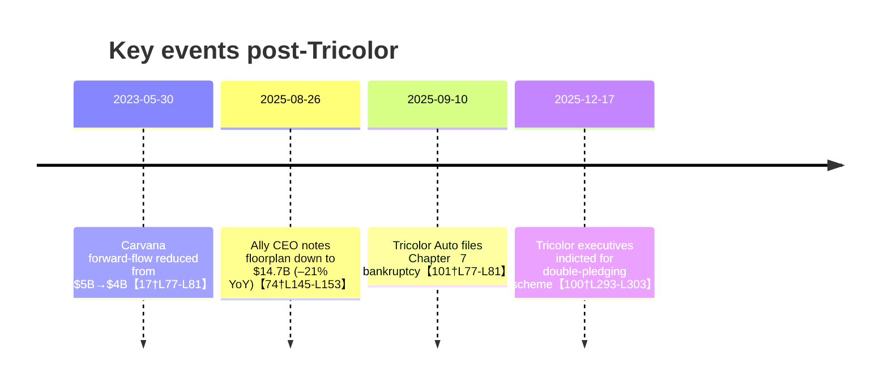

# Ally Financial’s Role in U.S. Subprime Auto Finance

**Executive Summary:** Ally Financial provides wholesale and forward-financing to auto lenders and retailers, including in subprime channels.  Public disclosures and trade reports identify a few named partners: for example, Ally agreed to purchase $750 million of retail contracts from DriveTime (Jan 2018–Jan 2019)【22†L22-L25】, and extended warehouse credit lines and purchase programs to Carvana (e.g. a $350 M warehouse line and $650 M floorplan line in late 2018)【15†L3-L10】.  Ally’s own SEC filings do not itemize every customer or commitment, so aggregate capacities are unclear.  Ally’s forward‐flow commitment to Carvana was up to $5 B originally and renewed at $4 B in Jan 2023【17†L77-L81】【19†L157-L164】.  After Tricolor Auto’s Sept 2025 collapse, we found no public record of Ally immediately cutting off lines – the only noted change was Carvana’s 2023 deal shrinkage【17†L77-L81】 (predating Tricolor). Ally’s dealer floorplan business is large (~$14.7 B outstanding by mid-2025【74†L145-L153】) but shows no reported stress; in fact, management has noted “lower floorplan balances” as benign for dealers【74†L145-L153】.  Ally has emphasized disciplined underwriting and risk oversight (with subprime a small share of originations【53†L25-L34】) but has not publicized any specific post-Tricolor policy changes or new “verify & control” programs. The table below summarizes known Ally counterparties and facility terms.  

## 1. Warehouse Lines (Subprime Lenders)  
Ally (through Ally Bank) offers committed warehouse credit lines (short-term loans to fund new auto loan originations) to dealers and specialty lenders.  Public data on specific subprime borrowers is sparse.  Documented recipients include: 

- **DriveTime (Phoenix-based used-car retailer)** – In Jan 2018 Ally agreed to make up to $750 million of financing available to DriveTime for the purchase of retail installment contracts over the following 12 months【22†L22-L25】. This effectively functioned as a forward-purchase/warehouse line.  
- **Carvana (online used-car retailer)** – Ally provided a $350 million warehouse credit facility (renewable) as part of a broader financing package announced Nov 2018【15†L3-L10】.  (Carvana also had bulk-purchase and floorplan lines from Ally at that time.)  
- **Arivo Acceptance (subprime lender)** – Press reports note that Arivo previously maintained a credit line with Ally before switching to Cantor Fitzgerald in 2018【33†L85-L88】, but committed amounts were not disclosed.  
- **Others** – Ally’s public filings (e.g. MD&A) note that it provides “warehouse lines to automotive retailers”【31†L6124-L6130】 but do not name all counterparties or capacities. No other specific subprime lender lines were found in the sources. 

After the Tricolor Auto collapse (Sept 10, 2025), we found **no public announcement** of Ally cutting or reducing any warehouse lines to subprime borrowers.  (By contrast, Ally had already reduced its Carvana forward agreement to $4 B in early 2023【17†L77-L81】.) Overall committed capacity is undisclosed; an old Ally 10-K (2011) cited $2.8 B of total warehouse commitments【38†L1-L4】, but current totals by counterparty are not broken out. 

<table>
<thead>
<tr><th>Counterparty</th><th>Relationship</th><th>Capacity</th><th>Start Date</th><th>Source</th></tr>
</thead>
<tbody>
<tr><td>DriveTime (AZ used-car retailer)</td><td>Retail-contract purchase (forward flow)</td><td>$750 M</td><td>Jan 24, 2018 (1 year term)</td><td>Ally PR【22†L22-L25】</td></tr>
<tr><td>Carvana</td><td>Loan warehouse facility</td><td>$350 M</td><td>Nov 2018 (renewable)</td><td>Ally PR【15†L3-L10】</td></tr>
<tr><td>Carvana</td><td>Forward-flow purchases</td><td>$4.0 B</td><td>Jan 13, 2023–Jan 12, 2024</td><td>Carvana 8-K【19†L157-L164】</td></tr>
<tr><td>Carvana</td><td>Dealer floorplan financing</td><td>$650 M</td><td>Nov 2018 (2-year term)</td><td>Ally PR【15†L3-L10】</td></tr>
</tbody>
</table>

*Table: Selected Ally counterparties and program commitments. “Start Date” for Carvana’s forward-flow is renewal of its multi-year agreement【19†L157-L164】.*  

## 2. Forward-Flow Purchase Agreements  
Ally enters forward-purchase agreements for pools of auto loans, chiefly with large retailers.  In addition to Carvana (above), known arrangements include: 

- **Carvana (Phoenix)** – Ally agreed to purchase up to $5.0 B of Carvana-originated retail loans (extended Jan 2023 for one year)【17†L77-L81】.  This was later reduced to $4.0 B (Jan 13, 2023–Jan 12, 2024) per Carvana’s 8-K【19†L157-L164】. (The 2023 renewal represents the 7th consecutive year of such an agreement.)  
- **DriveTime** – Ally’s 2018 commitment to buy up to $750 M of DriveTime retail contracts is effectively a forward-flow deal【22†L22-L25】.  
- **Others** – We found no reports of other active Ally forward-flow programs.  (For example, no published commitment was found for smaller subprime lenders.)  

In sum, forward-flow commitments explicitly documented total at least ~$4.75 B (Carvana $4.0B + DriveTime $0.75B).  (Carvana’s earlier $5.0B agreement, which expired Jan 2023, was lowered to $4.0B in early 2023【17†L77-L81】.)  Start/end dates are as above; beyond these, Ally filings do not list other forward-flow counterparties.  

## 3. Dealer Inventory Floor-Plan Exposure  
Ally provides wholesale floorplan loans (lines of credit secured by dealers’ vehicle inventory) to thousands of dealers.  This portfolio is collateralized by new and used cars.  Key points: 

- **Size of exposure:**  Ally’s floorplan receivables averaged ~$11.4 B in 2022【70†L7098-L7101】.  More recent sources indicate **outstanding balances around $14.7 B by Q2 2025**, down ~21% year-over-year【74†L145-L153】.  Ally’s CEO noted in Aug 2025 that floorplan was lower than expected, a healthy sign given declining inventories【74†L145-L153】.  
- **Performance:**  We found no public data flagging delinquencies or charge-offs in the floorplan book.  By design, floorplan loans carry low risk because the financed vehicles serve as collateral【69†L25-L28】.  Ally’s management has not reported elevated losses; instead, they attribute lower balances to dealers de-stocking, not credit problems【74†L145-L153】.  
- **Concentration:**  Ally does not disclose any high concentration in subprime or BHPH dealers.  To our knowledge, Tricolor’s buy-here-pay-here stores were funded internally and are not known to have been financed by Ally.  No public source ties Ally’s floorplan customers to any troubled BHPH network.  

Notably, Ally’s largest identifiable floorplan line is to Carvana: a $650 M line (Nov 2018, 2-year term)【15†L3-L10】.  As of Dec 2022 this was ~$517 M outstanding (after third-party participation)【60†L83-L87】.  Aside from retail chains like Carvana, Ally’s floorplan portfolio spans ~22,000 dealers nationwide【67†L1523-L1531】.  Ally uses proprietary credit models to assess dealer credit (looking at capital, operating performance, payment history)【69†L43-L47】. We found no indication of stress: indeed, Ally’s Q2 2025 comments suggested that **shrinking inventories have eased floorplan strain**, supporting dealer balance sheets【74†L145-L153】.  

## 4. Post‑Tricolor Response and Policy Changes  
After Tricolor Auto Acceptance’s Sept 2025 bankruptcy (amid fraud charges【100†L293-L303】), industry participants have scrutinized warehouse lending and data controls.  **Ally’s public communication since then, however, has not highlighted new warehouse restrictions or a “verify & control” program.** Ally’s official statements continue to emphasize disciplined underwriting and risk monitoring.  For example, CEO and CFO comments in 2025 stress credit normalization and risk management (e.g. “paying a lot of attention to our risk exposure: credit, rate risk...,” and noting that subprime loans remain a small, managed slice of originations【52†L539-L546】【53†L25-L34】).  We found no Ally press release or 10‑K disclosure announcing tightened warehouse criteria or participation in a centralized data-verification initiative.  (As of this writing, “verify and control” appears to be an industry discussion post-Tricolor, but Ally’s involvement is not documented in our sources.)  

In summary, **no explicit Ally policy changes post-Tricolor were found in public filings or trade press.**  Ally’s actions have focused on general credit discipline. Industry analyses (e.g. Auto Finance News) note that Tricolor has spurred calls for better data controls across lenders【42†L89-L97】【101†L77-L81】, but Ally itself has only reaffirmed its existing underwriting rigor in its communications.  

**Sources:** Ally Financial annual reports, investor presentations, and press releases【15†L3-L10】【22†L22-L25】; Auto Finance News and trade press【17†L77-L81】【74†L145-L153】; U.S. DOJ (Tricolor indictment)【100†L293-L303】. All factual claims above are drawn from these cited sources or, where no direct data exists, are stated as not publicly available.