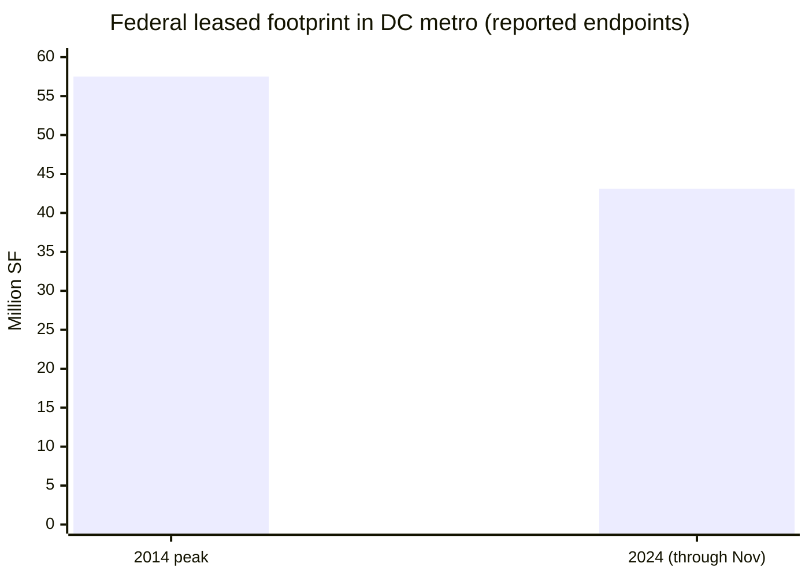
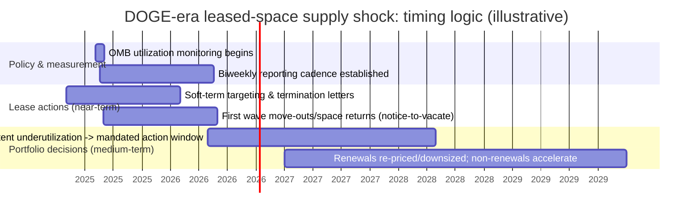
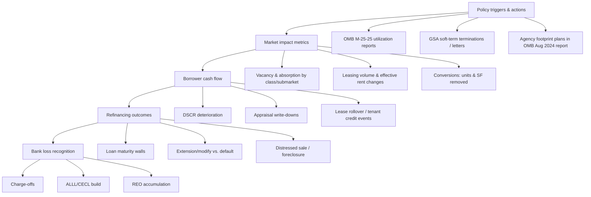

# RP-CREED-10: DC Office Market and Federal Workforce Reduction Impact

## Executive Summary

Federal tenant demand is a structural “base load” for the Washington, D.C. metro office ecosystem, but it has been shrinking for years and is now exposed to an additional policy shock from DOGE-era federal workforce optimization and lease downsizing initiatives. citeturn37view0turn10view0turn11view0

Three primary forces matter most for credit and valuations:

First, the federal government’s leased footprint in the Washington metro has already declined materially versus its earlier peak. citeturn37view0 This historical right‑sizing means some demand destruction is “past tense,” but it also indicates the direction of travel and the institutional capability to consolidate space. citeturn37view0turn34view0

Second, policy has shifted from “encourage consolidation” to “measure, enforce, and shrink.” The April 2025 OMB memo implementing the USE IT Act operationalized a governmentwide utilization benchmark (150 usable square feet per person) and an effective utilization target (60%), required utilization monitoring starting May 2025, and instituted biweekly reporting cadence. citeturn11view0turn10view0 This creates a measurement-and-trigger mechanism that can convert persistent underutilization into mandatory actions (including reductions) over a defined horizon. citeturn11view0turn10view0

Third, the transmission mechanism to private office fundamentals and bank credit losses is not instantaneous. The earliest market impacts come from “soft term” lease terminations and non-renewals (a 6–18 month channel), while the bulk of bank CRE losses typically emerges around refinancing events (a 18–48 month channel), especially for office collateral where valuation and take‑out liquidity are most impaired. citeturn10view0turn40search1turn43view1turn40search5

Quantitatively (directionally, using CBRE’s metro-level federal leased footprint as the baseline), a 10% / 25% / 50% federal workforce reduction implies roughly 4.3M / 10.8M / 21.5M square feet of potential leased-space demand reduction if space scales proportionally with headcount and is executed through non-renewals/terminations rather than pure restacks. citeturn37view0turn11view0 The realized impact depends on (i) the share of cuts landing in the region, (ii) how much consolidation shifts demand from leased to federally-owned space rather than “net exiting,” and (iii) the pace at which lease legalities allow exits. citeturn10view0turn11view0turn34view0

From a bank credit lens, DC-area community and regional banks show meaningful CRE concentration and explicit attention to office risk in filings—most importantly for locally concentrated lenders. For example, Eagle Bancorp reports large office-loan balances concentrated in the Washington metro and substantial criticized/classified office exposure (though down year-over-year), while Burke & Herbert reports a sizable office building/condo exposure within its CRE book including meaningful DC and Maryland balances. citeturn40search1turn40search0turn43view1 Western Alliance reports non-owner occupied office as “less than 5%” of CRE but also reports office-related charge-offs and REO additions tied to office. citeturn40search5turn40search2

## Federal Government as Tenant

The federal footprint should be treated as a *regional demand anchor with a long, policy-shaped unwind*, not as a normal economic-cycle tenant category. citeturn37view0turn34view0

### Federal share of DC metro office leasing

CBRE estimates the federal government leases **more than 43 million square feet across the Washington, D.C. Metro**, making it the region’s largest office occupier. citeturn37view0 Because public, primary-sourced “total DC metro office inventory” figures are inconsistently published in accessible form, the cleanest defensible treatment is as a **range** rather than a single point estimate. Multiple market analyses using GSA-derived inventory have characterized federal/GSA-leased exposure as roughly “~10%–low‑teens” of the metro’s office stock (noting definitional differences: “GSA-leased” vs “all federal leased”). citeturn36search12turn37view0turn36search4

Operationally, CBRE’s 43M+ leased SF implies that even small percentage changes in federal leasing behavior can swing regional absorption and vacancy—particularly for submarkets with high federal clustering. citeturn37view0turn36search1

### Historical demand trend: federal leased footprint and leasing velocity

CBRE reports the federal leased footprint in the metro **peaked at 57.5M SF in 2014** and has **decreased by 14.4M SF** since that peak, consistent with long-running right‑sizing that accelerated under persistent telework. citeturn37view0

Mermaid chart (illustrative, based on CBRE-reported endpoints):  

The 2024 bar uses CBRE’s “more than 43M” framing as an approximate 43.1 for visualization; directionality is the point, not the second decimal. citeturn37view0

Leasing flow is also below historical norms: CBRE reports **2.3M SF of federal leasing through November 2024**, representing **~17% of all leasing activity** in the region, but **down 33% year-over-year** and **down 52% versus the long-term annual average**. citeturn37view0

Separate from private-market reports, federal real property cost and utilization data points to structural pressure for further cuts. OMB’s August 2024 report states that annual costs in the FRPP office portfolio include **$4.751B of annual office lease cost** plus operations and maintenance, with a total annual owned+leased office portfolio cost of **$8.086B**; it also reports **underutilized** office space in FRPP including **23.280M SF (owned)** and **0.766M SF (leased)**. citeturn35view2turn35view0

### GSA lease portfolio: size and what is observable from primary sources

A GAO testimony (Dec 2025) describes GSA’s Public Buildings Service portfolio as **about 8,500 owned and leased properties covering ~359M square feet**, housing **80 tenant agencies**, and collecting **more than $10B annually in rent** from tenants. citeturn10view0 This is the best single primary-source snapshot available in accessible text for total PBS scale (but it is not limited to “leased office only”). citeturn10view0

**Lease term and year-by-year expiration schedule (2024–2035):** GSA publishes a monthly external lease inventory and detailed datasets, but in this environment the underlying machine-readable lease inventory files are not directly ingestible, preventing a fully reconciled lease-by-year expiration table from primary data. The market-relevant substitute is a “policy-and-rights-driven timing” profile (see DOGE Modeling) anchored on: (i) near-term maturation/termination waves reported by market sources drawing from federal lease data, and (ii) the formal policy triggers and deadlines established by OMB/USE IT Act implementation. citeturn36search3turn11view0turn10view0

### Which agencies have the largest footprints and which are likely DOGE targets

Because agency-by-agency leased square footage in the metro is not uniformly disclosed in a single primary table, the most defensible approach is to identify “largest footprint” agencies through (a) their own portfolio disclosures in OMB’s August 2024 Report to Congress and (b) high-profile lease events documented by CBRE and public reporting. citeturn34view0turn37view0

**Examples of large DC/NCR footprint indicators in primary materials:**
- The report includes explicit NCR footprint detail for the **Department of Veterans Affairs** (VACO HQ footprint totaling **1.4M SF under GSA Occupancy Agreements**, with a reported **~16% reduction (~270k SF) from 2020–2022** in NCR strategies). citeturn35view2  
- The **Environmental Protection Agency** describes its “large scale office portfolio” (HQ + 10 regional offices) totaling **~3.18M usable SF** and proposes releasing **~20% of leased spaces over FY2025–FY2029** (subject to funding for renovations/relocations). citeturn35view2  
- The **Department of Transportation** reports an updated space policy (effective April 2024) calling for **~21% reduction of usable SF per person** and adoption of non-dedicated assigned space practices, with HQ concentration in the National Capital Region. citeturn35view2  

**DOGE “likely target” criteria (evidence-based, not partisan):**  
An agency is a higher-probability “space reduction target” under a workforce optimization regime when it meets several of the following criteria supported by primary references:
- **Low observed utilization / high telework posture** (GAO found many HQ buildings at ~25% utilization or less in early 2023 samples; some agencies much lower). citeturn30search2turn36search3  
- **High ability to consolidate** via colocation or shifting from leased to owned federal space (Space Match program and right‑sizing/optimization programs explicitly pursue this). citeturn10view0turn9search6  
- **Lease legal optionality** (leases in “soft term” or near end of term) enabling faster exits. citeturn10view0turn36news42  
- **Policy trigger exposure** under OMB utilization monitoring and USE IT Act implementation (benchmarking + monitoring + potential mandated action after persistent low utilization). citeturn11view0turn10view0  

Using GAO/CoStar-described utilization lows as an indicator of consolidation pressure, agencies that showed especially low building usage in sampled weeks included the Departments of Agriculture and HUD, plus SBA and SSA, among others. citeturn36search3turn30search2 These should be treated as higher-likelihood “rightsizing candidates” for physical footprint reductions absent mission constraints, though the ultimate decision is driven by statutory mission needs, security considerations, and funding for reconfiguration/moves. citeturn35view0turn11view0

## DOGE Impact Modeling

This section translates the policy environment into square-foot demand scenarios and a market-timing view.

### Baseline assumptions (explicit)

- Baseline **federal leased footprint in DC metro:** **43M+ SF** (CBRE). citeturn37view0  
- **Space design benchmark:** **150 usable square feet per person** (OMB M‑25‑25). citeturn11view0  
- **Utilization target reference:** OMB guidance defines building utilization relative to a 150 USF/person benchmark with agency targets set at **60%** of that benchmark. citeturn11view0  
- **Hybrid work context:** telework-eligible personnel spent ~**60%** of regular working hours in-person in May 2024, with ~**50%** of federal workers in roles not eligible for telework. citeturn34view0  

### Modeled square-foot reductions from federal workforce cuts

A simple, transparent first-pass model is proportional scaling of leased office SF with assigned headcount, using the 150 USF/person design benchmark as the sizing ratio.

**Implied metro-assigned headcount supported by current leased footprint (scale estimate):**  
43,000,000 SF / 150 USF per person ≈ **~287,000 assigned personnel-equivalents** (this is a sizing construct; it does not assert all such personnel are physically in DC daily). citeturn37view0turn11view0

**Square-foot impact scenarios (leased footprint):**

| Scenario | Workforce reduction | Modeled leased SF reduction (approx.) | Interpretation |
|---|---:|---:|---|
| Best-case stress | 10% | ~4.3M SF | Comparable to one year of several large renewals “rolling down,” plus some terminations. citeturn37view0turn10view0 |
| Central stress | 25% | ~10.8M SF | A multi-year vacancy shock in federal-heavy submarkets if realized as net move-outs. citeturn11view0turn37view0 |
| Severe stress | 50% | ~21.5M SF | Systemic demand reset likely exceeding offset from private-sector growth; would require large-scale lease event execution. citeturn10view0turn36news42turn37view0 |

These are *gross potential* reductions. Realized market impact depends on (i) how much is consolidated into other federal space (netting out), and (ii) lease/legal timing. citeturn10view0turn11view0

### GSA and OMB footprint reduction mechanisms and timelines

**OMB utilization monitoring timeline (hard dates):**
- Agencies must begin utilization monitoring by **May 4, 2025**; first report due **May 19, 2025**; reporting at least biweekly thereafter. citeturn11view0  
- Utilization calculations tie directly to an occupancy benchmark (150 USF/person) and a utilization target (60%). citeturn11view0  

**GSA lease reduction tactics described by GAO (hard mechanics):**
- GSA targeted leases in the “soft term” (termination-rights window) and reported **260+ completed lease terminations or intent-to-terminate letters** with estimated **$112M annual cost savings**. citeturn10view0

**Disposition acceleration (owned assets, but relevant to tenant relocations):**
- GAO reports an accelerated approach identifying **45 federal properties** for disposal, estimated to reduce inventory by **14.6M SF** and reduce annual operations plus deferred maintenance costs. citeturn10view0

These mechanisms imply two distinct demand pathways: (1) near-term leased-space givebacks under soft-term rights, and (2) medium-term relocations prompted by owned-building disposal/optimization, which can either increase *leased* demand (if agencies move out of owned into leased) or decrease *leased* demand (if consolidating into owned). citeturn10view0turn9search4

### Submarket exposure: where the shock concentrates

Federal occupancy clusters are not evenly distributed; the highest “first-order” exposure is in submarkets with dense federal tenancy and proximity to federal campuses/transit nodes. CBRE highlights that ridership at stations adjacent to many federal agencies remains less than 50% of pre-pandemic levels, consistent with persistent hybrid behavior and the opportunity for further space reduction. citeturn37view0

Because lease-level building rosters and maturities are not fully extractable here from primary lease inventory files, the practical risk view is *submarket risk archetypes* plus *known large-lease events* documented in major research feeds:

| Submarket | Why exposure is high | What “at risk” tends to look like (asset archetype) | Observable supporting signals |
|---|---|---|---|
| L'Enfant / SW | High federal concentration; ridership proxy still depressed | Mid/late‑vintage, large floorplate federal leases; potential consolidations/terminations | CBRE ridership and federal right‑sizing commentary. citeturn37view0turn36search1 |
| Crystal City | Federal/defense-adjacent demand but vulnerable to consolidation and contractor spillover | Older commodity stock loses first; newer stock may capture “flight to quality” if agencies restack | “Federal downsizing” cited as a demand headwind in DC research. citeturn36search4turn44search4 |
| Rosslyn | Similar to Crystal City: contractor adjacency, transit-oriented but cost-sensitive | Class bifurcation: best-in-class holds; older faces obsolescence | Broader office distress + cap-rate repricing dynamics. citeturn44search1turn44search4 |

### Timing: when non-renewals and terminations hit the market

The critical point for market and bank analysis is timing: leases roll off and terminate with notice periods, not instantly.

This aligns with: OMB’s hard start date for measurement (May 2025) and GAO’s description of soft-term lease targeting and completed terminations, which are the fastest channel for new vacancy. citeturn11view0turn10view0turn36news42

## Private Sector Spillover

Federal tenant contraction is amplified by a “federal-adjacent” private ecosystem: contractors, grantees, law firms, lobbyists, consultants, trade associations, and NGOs. This spillover operates through budget changes, program cancellations, procurement timing, and the density economics of downtown office usage. citeturn36search6turn34view0

### Contractor and grantee behavior (direct spillover)

CBRE’s Q1 2025 market commentary explicitly linked office uncertainty to federal actions affecting agencies and funding, noting that contractors and grantees were still determining the path forward and that real estate needs were not yet resolved in the wake of agency disruption. citeturn36search6 This is the clearest “primary broker research” evidence of the spillover channel translating to real estate decision delays.

CoStar reporting has also emphasized that the Washington region’s office recovery is sensitive because the federal government is the region’s largest office occupant and because federal employment share is material (reported as ~20% of jobs in the Washington area in one CoStar analysis). citeturn36search11

### Law firms, lobbyists, consultants (partial offsets, but not symmetric)

Even as federal lease activity declines, CBRE’s Washington, DC city reports show sustained law-firm activity and a “flight to quality.” Q2 2025 notes law firms leasing new space and relocating, while Q4 2025 highlights strong performance in top-tier inventory and multiple private-sector renewals. citeturn36search1turn46view0

This private leasing can stabilize trophy/A+ properties while leaving older B/C stock exposed to federal and contractor contraction—i.e., the offset is **class-segmented**, not market-wide. citeturn46view0turn44search1

### Multiplier estimate: methodology and range

A conservative way to express spillover is as a **multiplier on federal leased SF reductions** that captures net private-sector contraction attributable to federal workforce/budget changes.

Method (transparent):
1. Start with a federal leased-space reduction scenario (from DOGE modeling). citeturn37view0turn11view0  
2. Apply a multiplier “m” to represent additional private-sector occupied SF that is ultimately removed due to federal cuts.  
3. Use a range for m reflecting uncertainty and class bifurcation.

Suggested range for m in DC metro (defensible, scenario use):
- **Low spillover:** m = 0.25 (private sector demand loss equals 25% of federal SF giveback; assumes meaningful offset from law firms/flight-to-quality and conversion pipeline absorbing obsolete supply). citeturn46view0turn45search0  
- **Central spillover:** m = 0.50 (one-for-two effect; contractors and adjacent services retrench, partially offset by high-end leasing). citeturn36search6turn46view0  
- **High spillover:** m = 0.75 (budget and workforce cuts propagate broadly, reducing contractor and NGO footprints; private offsets insufficient). citeturn36search11turn44search4  

Illustration: Under the 25% federal cut case (~10.8M SF), total demand destruction including spillover could range from **~13.5M SF (m=0.25)** to **~18.9M SF (m=0.75)**. citeturn37view0turn11view0

## DC Office Fundamentals

DC office stress is best described as **high vacancy with bifurcated performance** (trophy/A+ vs commodity B/C), plus an unusually large policy-driven tenant risk. citeturn46view0turn36search1

### Vacancy and absorption

For Washington, DC (city), CBRE reports **vacancy at 22.5% at end of Q4 2025**, with occupancy loss concentrated in **Class B** and a notable vacancy increase in that segment during the quarter. citeturn46view0

In the first half of 2025, BNP Paribas Real Estate reports combined net absorption of roughly **−950,000 SF** across Q1 and Q2 2025 (−295,101 SF in Q1; −654,614 SF in Q2), attributing softness in part to federal workforce uncertainty. citeturn44search4

CBRE’s Q2 2025 city report notes federal contractions and termination notices as a driver of vacancy pressures, with occupancy loss of **395,984 SF** contributing to a **22.6%** vacancy rate in that quarter. citeturn36search1

### Leasing volumes and class segmentation

CBRE reports **7.1M SF of leasing in 2025**, about **10% below the 10-year historical average**, while also emphasizing strong demand and low vacancy in the trophy segment (trophy vacancy cited at **10.7%** in Q4 2025). citeturn46view0 This supports a “flight-to-quality + obsolescence” narrative rather than a uniform collapse. citeturn46view0turn44search1

### Conversion pipeline (supply removal and value stabilization)

The District has explicitly adopted office-to-residential conversion as a stabilization tool. A January 2026 release from Washington, DC leadership describes the “Housing in Downtown” program structure (20-year tax abatement) and reports:
- **~1,904 housing units** converted from office space in 2024–2025,  
- **~1,803 units under construction**,  
- **~4,258 units** in the conversion pipeline,  
- **~7,965 units** completed/under construction/in pipeline overall, and  
- an estimate that the program will help deliver **~6.7M SF of new residential use** (or **~8,400 units**). citeturn45search0

This conversion pipeline matters for credit because it removes obsolete office inventory and provides a “floor” bid for some distressed assets, but it is targeted and project-specific—not a full absorption solution. citeturn45search0turn44search3

## Bank Exposure

This section focuses on disclosed exposures in bank filings (primary) and relates them to DC office tenant risk.

### Why DC office demand matters for banks

Office collateral risk emerges through (i) NOI impairment, (ii) valuation reset, and (iii) refinancing friction. The DC metro is uniquely sensitive because (a) federal tenancy is unusually large and (b) policy can turn underutilization into mandated reduction actions. citeturn11view0turn37view0

### Selected bank exposures (filing-based)

**entity["company","Eagle Bancorp, Inc.","community bank; dc area"] (EGBN)**  
Eagle discloses deep geographic concentration in the Washington metro and explicitly quantifies office-loan exposure:
- As of June 30, 2025, it reports meaningful loan concentration across Washington, D.C. and nearby Maryland/Virginia submarkets, and states that income-producing CRE loans collateralized by office properties were **~$819.8M** (10.6% of total loans) and that office loans within Washington, D.C. and its defined suburban submarkets were **~$766.5M** (9.9% of total loans). citeturn40search1  
- As of September 30, 2025, the company reports that **office‑collateralized CRE loans criticized or classified** declined to **$113.1M** from **$287.0M** at December 31, 2024, and it notes active balance-sheet actions to reduce office valuation risk. citeturn40search0  

This is a direct, locally relevant “office credit sensitivity” indicator: a material office book plus evidence of stress migration that is improving, but still meaningful. citeturn40search0turn40search1

**entity["company","Burke & Herbert Financial Services Corp.","community bank; virginia"] (BHRB)**  
In its filings, Burke & Herbert explicitly discusses office-market risk drivers, including federal workforce impacts, and it provides collateral-type and geography tables:
- The bank states its CRE sector is impacted by rising vacancies and that “recent reductions, and possible further reductions, in the federal workforce” could challenge the economy and CRE sector in its markets. citeturn43view0turn41search1  
- It reports CRE exposure at March 31, 2025 of **$2.81B** (49.7% of gross loans) excluding owner‑occupied CRE and acquisition/development/construction; including those, total exposure rises to **$3.7B** (65.8% of gross loans). citeturn41search1turn43view1  
- Critically for office: its “Commercial Real Estate by Collateral Type and Geographic Location” table shows **Office Buildings/Condos totaling ~$461.2M** in the CRE book, including **~$57.5M in DC**, **~$115.4M in Maryland**, and **~$194.8M in Virginia** (plus WV/Other). citeturn43view1  

This is a meaningful, explicitly quantified office collateral exposure in the DC orbit. citeturn43view1

**entity["company","Western Alliance Bancorporation","regional bank"] (WAL)**  
Western Alliance’s filings position office as a smaller portion of its CRE, but still economically relevant through realized losses:
- It reports CRE-related loans at ~29–30% of total loans, with **non-owner occupied office loans “less than 5%”** of CRE loans (excluding construction and land). citeturn40search5turn40search7  
- It reports that during the nine months ended September 30, 2025, gross charge-offs on CRE non-owner occupied loans totaled **$44.9M**, primarily related to office properties. citeturn40search5  

This illustrates how even “small share” office books can drive charge-offs in stressed environments, and provides a comparator for how quickly losses can emerge once defaults occur. citeturn40search5

### Comparative table (estimated DC office sensitivity)

Because not all banks break out “DC office” the same way, the table separates *office within DC orbit* from *office as a share of CRE*. All values are as disclosed in cited filings.

| Bank | Reported office exposure metric | DC-orbit specificity | Key risk note |
|---|---|---|---|
| Eagle Bancorp | Office CRE loans ~10% of total loans (mid‑2025); criticized/classified office exposure reported (Sep 2025) | High (DC + MD suburbs + N. VA breakdown provided) | High local concentration raises sensitivity to DC office fundamentals. citeturn40search1turn40search0 |
| Burke & Herbert | Office Buildings/Condos ~461M in CRE book (Mar 2025) | Medium-High (DC/MD/VA split provided) | Filings explicitly cite federal workforce reductions as CRE risk. citeturn43view1turn41search1 |
| Western Alliance | Non-owner occupied office <5% of CRE; office-related charge-offs reported (2024–2025) | Low (national/regional; not DC-specific) | Demonstrates charge-off pathway once office loans break. citeturn40search5turn40search48 |

## Valuation Impact

Valuation outcomes depend on (i) tenant durability, (ii) building class/obsolescence, (iii) conversion optionality, and (iv) capital markets pricing (cap rates). citeturn44search1turn45search0

### Transaction comps: price per square foot and distress signals

Distress is observable in foreclosure and “reset” trades.

- A prominent example: a renovated 10-story DC office building at **1750 H Street NW** sold at foreclosure for **$17.6M**; the building is reported as **123,000 SF**, implying pricing around **$143/SF**. citeturn44search3  
- DC has also seen “rock-bottom” sales reported in early 2026, consistent with continued price discovery in secondary stock. citeturn44search5  

These prints are far below historical replacement cost and signify that the market is pricing in (a) prolonged vacancy, (b) higher cap rates, and/or (c) high conversion/retrofit costs. citeturn44search3turn44search1

### Cap rate trends: DC versus national context

A CBRE-EA analysis suggests that by late 2024, a large share of Class B/C office properties were being valued at **double-digit cap rates** (72% in H2 2024 in their survey framework), with signs of plateauing rather than continued rapid deterioration. citeturn44search1

For DC specifically, BNP Paribas Real Estate notes elevated vacancy and negative absorption in early 2025 amid federal workforce uncertainty and highlights opportunistic investor interest in distressed assets as a plausible near-term capital source. citeturn44search4

### Conversion option as a valuation “backstop”

The District’s explicit conversion incentives (20-year tax abatement under Housing in Downtown and related financing structures) can raise the “option value” of certain obsolete offices, increasing the probability of a bid even when office cash flows are impaired. citeturn45search0turn45news52 This can meaningfully affect LGD outcomes for lenders on older, well-located buildings. citeturn45search0turn44search3

## Early Warning Indicators and Timeline to Bank CRE Losses

This final section lays out leading indicators and answers the key question: **When does DOGE-driven demand destruction flow through to bank CRE losses?**

### Practical early warning indicators and sources

| Indicator | What it signals | Primary/credible source examples |
|---|---|---|
| GSA lease termination actions (soft-term letters, terminations) | Near-term vacancy shock; landlord cash-flow disruption | GAO describes soft-term targeting and 260+ lease terminations/letters with savings estimate. citeturn10view0 |
| OMB utilization monitoring compliance (biweekly occupancy reporting) | Institutionalization of the reduction mechanism; future mandated actions | OMB M‑25‑25 deadlines, benchmarks, reporting cadence. citeturn11view0 |
| Agency-specific footprint reduction plans (FY2025–FY2029) | Medium-term roll-down through planned releases | OMB August 2024 report includes agency narratives (e.g., EPA 20% release over FY2025–FY2029). citeturn35view2turn34view0 |
| DC office market absorption/vacancy inflections by class | Whether private sector offsets are material or only quality-segment | CBRE DC figures; BNP Paribas H1 2025 net absorption. citeturn46view0turn44search4 |
| Conversion starts/financings (HID pipeline) | Supply removal supporting valuation floors | DC official HID reporting and pipeline metrics. citeturn45search0 |
| Bank disclosures: criticized/classified office loans, charge-offs, REO | Where credit is breaking; timing of loss recognition | EGBN criticized/classified office exposure; WAL office-related charge-offs; BHRB office exposure tables. citeturn40search0turn40search5turn43view1 |

### Monitoring dashboard flow (proposed)

Each node maps directly to a cited disclosure stream: OMB implementation deadlines, GAO lease-termination mechanics, broker market metrics, DC conversion pipeline, and bank filing credit metrics. citeturn11view0turn10view0turn46view0turn45search0turn40search0turn43view1turn40search5

### Answer: timeline from DOGE demand destruction to bank CRE losses

**Key lags (mechanical):**
- **Lease-action lag (6–18 months):** Notice-to-vacate, move logistics, and landlord downtime; fastest when leases are in soft term and termination rights are exercised. citeturn10view0turn36news42  
- **Cash-flow-to-credit lag (6–24 months):** NOI declines pressure DSCR and covenant compliance; lenders begin criticized/classified migration. Eagle’s filings show how office loan risk can shift between classified buckets across quarters. citeturn40search0turn40search1  
- **Refinancing/default lag (18–48 months):** Most realized losses cluster around maturity/refinancing events or workout resolutions; foreclosure and distressed sales can occur earlier for already-impaired assets. citeturn44search3turn43view1  

**Scenario-based timelines (anchored to 2025 policy onset):**

| Scenario | Core assumptions | Demand destruction timing | Bank CRE loss timing (charge-offs / realized losses) |
|---|---|---|---|
| Best | 10% workforce cut; terminations largely offset by consolidations into other federal space; conversion pipeline absorbs obsolete stock; private-sector trophy demand stays firm | 2025–2027: moderate space returns via soft-term actions and selective non-renewals citeturn10view0turn45search0turn46view0 | 2026–2028: losses emerge primarily at maturity/refi; limited but persistent charge-offs for weakest B/C assets citeturn40search5turn44search3 |
| Median | 25% workforce cut; meaningful net leased SF reduction; contractor spillover material; Class B/C deterioration continues while top tier holds | 2025–2029: multi-year roll-down, with notable wave 2026–2028 as monitoring + underutilization triggers mature citeturn11view0turn10view0turn36search6 | 2027–2030: criticized/classified migration leads; realized losses cluster around 2027–2029 refinancings and workouts citeturn40search0turn43view1turn44search3 |
| Worst | 50% workforce cut; aggressive soft-term terminations and non-renewals; spillover high; limited offset from conversions/flight-to-quality | 2025–2028: rapid space returns, especially in federal-heavy clusters; vacancy shock overwhelms offsets citeturn36news42turn10view0turn37view0 | 2026–2029: earlier distress and foreclosures plus heavy CECL/charge-offs; peak losses 2027–2028 with extended tail citeturn44search3turn40search5turn43view1 |

**Sensitivity notes (what shifts timelines most):**
- **Lease legal optionality dominates the *front end***: the more reductions occur through soft-term termination rights (as GAO describes), the more vacancy can hit in 2025–2026 rather than waiting for natural expirations. citeturn10view0turn36news42  
- **Conversion execution speed dominates the *floor***: the District’s HID pipeline (units and SF) can absorb a meaningful portion of obsolete supply, but construction/financing timelines mean this support is uneven and not instantaneous. citeturn45search0turn45news52  
- **Refinancing conditions dominate the *loss recognition***: even modest demand shocks can create outsized losses if capital markets remain constrained, especially for B/C assets without a conversion path. citeturn44search1turn44search3  

In sum: **the earliest credible bank-loss window begins roughly 12–24 months after the first major lease-termination wave (i.e., 2026–2027), but the central mass of losses is more likely 2027–2029 under median-to-worst scenarios**, because the refinance/workout cycle is slower than the lease giveback cycle. citeturn10view0turn40search0turn43view1turn44search3