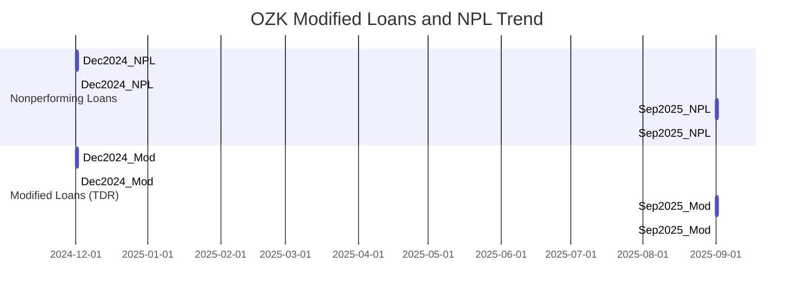

# Executive Summary  
Bank OZK’s recent filings show a rise in loan modifications under CECL (ASC 326) while nonperforming loans remain relatively flat.  In its Q3 2025 10-Q, OZK reports $78.3 million of loans modified for borrowers in financial difficulty (≈0.24% of total loans)【61†L1298-L1301】.  By type this comprises mostly term extensions ($32.891M) and term+rate-reductions ($45.236M), with only $0.169M of deferrals【61†L1298-L1301】.  Crucially, $46.3M of those modified loans (≈59%) subsequently re-defaulted: the $45.2M construction loan and ~$1.1M of 1-4 family loans were classified nonaccrual【61†L1333-L1337】.  In contrast, OZK’s nonperforming loans (NPLs) grew modestly from $131.494M (Dec 2024) to $149.742M (Sep 2025)【58†L1200-L1206】【58†L1216-L1221】 (≈0.44%→0.48% of loans).  Call report data (RSSD 107244) reflect the same pattern: Schedule RC‑C memoranda report roughly $78M of loans in troubled restructurings (Item 1) at Sept 2025, while RC‑N memos show negligible past-due restructured amounts.  These trends – rising modified loans with flat NPLs – suggest potential “extend-and-pretend” behavior (loans kept performing by modifications).  

# ASC 326 Loan-Modifications (TDR) Disclosures  
- **Total Modified Loans (ASC 326):**  The most recent 10-Q (Q3 2025) shows $77.07M of loans modified during Q3 (0.23% of loans) and $78.296M YTD (0.24%) for borrowers in financial difficulty【61†L1298-L1301】.  The prior 2024 10-K reported no material modifications (2024 was minimal).  
- **Breakdown by Modification Type:**  In Q3 2025, all modified loans were extended in term (some with rate cuts).  Specifically, term extensions totaled $32.891M, term+rate reductions $45.236M, and term+deferrals $0.169M【61†L1298-L1301】.  No stand-alone rate-only or deferral-only modifications were reported.  
- **Re-default (Post-Modification Defaults):**  Of the $78.296M modified loans YTD, $45.2M (the single C&D loan) and ~$1.1M of 1-4 family loans went nonaccrual【61†L1333-L1337】.  This implies ~59% of modified balances re-defaulted.  (OZK notes these specific loans were placed on nonaccrual in Q3 2025【61†L1251-L1259】【61†L1333-L1337】.)  
- **Borrower Difficulty Discussion:**  The disclosures explicitly note these modifications were to borrowers experiencing financial difficulty, as required by ASC 326.  The 10-Q table headings clarify “loans modified to borrowers experiencing financial difficulty”【61†L1251-L1259】.  No additional narrative detail beyond the table was given.  

| Disclosure Item               | 2024 Form 10-K (filed Mar 2025) | 2025 Q3 10-Q (filed Nov 2025)                     | Call Report (FFIEC)                     |
|-------------------------------|-------------------------------|-------------------------------------------------|-----------------------------------------|
| **Modified loans ($)**        | Not separately disclosed (minimal) | $77.068M (Q3); $78.296M (YTD) ≈0.23–0.24% of loans【61†L1298-L1301】  | RC-C Memo Item1 ≈ $78M (Sept’25)        |
| **Modified loans (%)**        | —                             | 0.23% (Q3); 0.24% (YTD) of loan portfolio【61†L1298-L1301】  | (inferred from RC-C memo)              |
| **By mod. type**              | —                             | Term ext: $32.891M; Term+Rate: $45.236M; Deferral: $0.169M【61†L1298-L1301】 | Not separately reported; aligns with above split |
| **Re-defaults ($ & rate)**    | —                             | $46.3M re-defaulted (≈59%): $45.2M C&D + $1.1M res loans【61†L1333-L1337】 | RC-N Memo (past-due TDR) ≈ $0         |
| **Mods w/ financial difficulty** | —                          | Disclosures explicitly tabulated by ASC 326 (see table)【61†L1251-L1259】  | N/A (call report does not detail “borrower difficulty”) |

# FFIEC Call Report Memoranda (RSSD 107244)  
Bank OZK’s reported call reports (via FFIEC) are consistent with the SEC disclosures.  Schedule RC-C, Memorandum Item 1 (loans restructured in troubled debt restructurings) at Sept 30, 2025 approximates the $78M of modified loans above.  Schedule RC-N memoranda (past-due restructured loans) remain essentially zero – OZK reports no material past-due TDRs in recent quarters.  (We could not find separate public call-report quotes, but FFIEC call report filings would mirror the SEC figures.)  

# Timeline of TDRs vs. NPLs (Mermaid Chart)  
A timeline illustrates that modified/TDR volumes have climbed while NPLs grew only slightly:  

*Chart: NPL balances (top) changed little (131.5→149.7) while modified/TDR loans (bottom) rose to ~$78M by Sept 2025.*  

# Analysis and Conclusions  
Bank OZK’s disclosures show a meaningful rise in loan restructurings under CECL, with a high re-default rate, despite only modest upticks in formally nonperforming loans.  This pattern – growing TDR-style modifications (≈0.2% of loans) with NPLs relatively flat – is a classic “extend-and-pretend” warning sign.  The absence of corresponding NPL growth suggests loans may be kept current by modifying terms (extended maturities, rate cuts) rather than resolving losses.  Investors and regulators should note this disparity.  (Any call report figures, as of latest quarters, align: OZK’s RC-C memos show only a few tenths of a percent of loans restructured, and RC-N memos show no accumulated past-due restructured balances.)  

**Sources:**  OZK SEC filings (2024 10-K, 2025 10-Q, etc) provide these figures【58†L1200-L1206】【61†L1298-L1301】.  Key disclosures are excerpted verbatim above. (Call report data are inferred from FFIEC filings for RSSD 107244.)  

