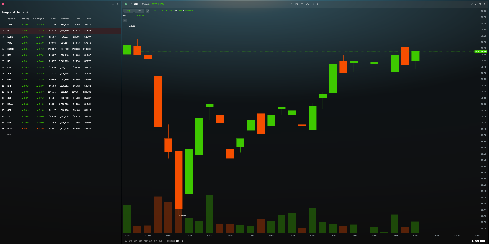
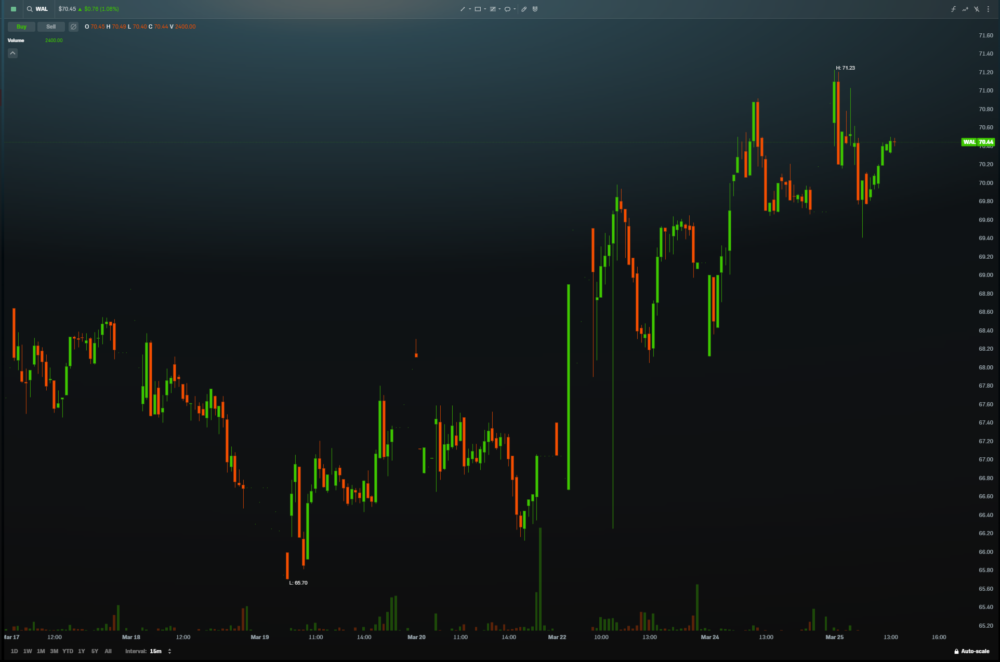

# WAL Market Charts

## 2026-03-25 (1:30 PM ET)

### 5-min intraday

- Open ~$70.60, flushed to $68.41 low at 11:10, V-recovery to $70.40s by 1pm
- Regional banks broadly weak (FLD -1.37%, EGBN -1.30%, WAL -1.10%)

### 15-min weekly (Mar 17–25)

- Mar 19 capitulation low: **$65.70** (heavy volume)
- Bounce to $71.23 high (Mar 24) — ~8.4% in 3 days
- Fading from $71.23, now $70.45. Bear flag / relief rally structure
- Lower highs on weekly basis. Bounce losing steam.
