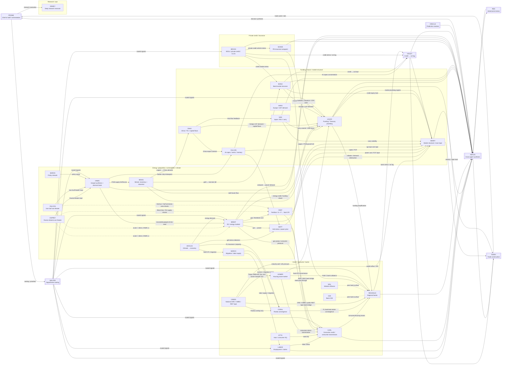

# AGENTS Network Map

**Purpose:** canonical topology for agent transmission, synthesis, and routing.

**Status:** live map source. Historical visual maps live in `PROME/archive/agent_network.*`. Do not maintain separate live topologies. Dormant agents with historically-wired edges (OZK, BARON) remain as reference nodes; retired / archive-source agents are omitted — full roster + tiers → [`_INDEX.md`](./_INDEX.md) + [`../PROME/ROSTER.md`](../PROME/ROSTER.md).

## Core model

Prome is the chief-of-staff/orchestration layer. Domain agents own source-detail. NEXUS/RED/VIOLET/TERRY convert domain work into synthesis, challenge, vol/tape timing, and trade construction.

## Chain summary

| Chain | Primary path | What confirms stress |
|---|---|---|
| Credit | LABOR → CARL → REGINALD → HENRY/LIQUID, with CREED feeding CRE/CMBS and public REIT tape bank-bridge stress | Claims/payroll composition, consumer DQ (housing asset-market feed via HOMER — see Housing chain), CRE maturity/default recognition, REIT equity/NAV/dividend stress, bank loss recognition, market repricing |
| Private credit | BROCK → SHADE → LIQUID / REGINALD | Gates, PIK/NAV stress, insurer wrapper funding, NDFI bank bridge |
| Energy shock / war | {OSPREY, FALCON} → HAWK → BRENT → HENRY/LIQUID/CARL (acute theater signals → BRENT direct, HAWK cc) | Theater kinetic/chokepoint events, cross-war reconciliation, Brent/storage/insurance, inflation/demand destruction |
| Housing | HOMER → CARL / REGINALD / HENRY | Foreclosure pipeline, GSE-vs-CMBS multifamily divergence, builder margins, HPI, mortgage-rate surface |
| Climate → economy | AEOLUS → BRENT / CORAL / MARCO | Insurance losses, ag/food supply shifts, energy-demand swings on a weather/structural horizon |
| Power | AEOLUS → WATT → HENRY / CARL; BRENT → WATT | Grid emergencies (PJM EEA), LMP spikes, capacity-auction clears at cap, data-center load |
| AI-capex | VULCAN → VIOLET / HENRY / WATT; ZHAO / HAWK → VULCAN | Hyperscaler capex guides, Mag-7 concentration, memory cycle, export controls, Taiwan chokepoint |
| Metals | {BOND, ZHAO} ↔ MIDAS → LIQUID / HENRY; HAWK → MIDAS | Gold real-rate divergence (debasement), copper/China demand, GSR, PGM supply |
| Japan/carry | SAM → LIQUID/HENRY | JGB/BOJ/carry unwind, USDJPY/FXY, global funding volatility |
| Credit-to-vol | BOND/BROCK/REGINALD → VIOLET → HENRY/LIQUID/RED | Credit spreads or bank stress widen before VIX/vol catches up |

## Ownership rules

- `AGENTS.md` owns compact roster, spawn restrictions, and canonical transmission chains.
- `AGENTS/_INDEX.md` owns grouped directory navigation.
- This file owns the live topology map — **specifically the MARKET-TRANSMISSION topology** (who moves what to whom as a thesis propagates).

> **⚠️ Two topologies, one repo — do not read this map as an org chart.** *(Phase 1 taxonomy pass, 2026-08-05.)* Market-transmission topology (this file) and **governance/review topology** (who owns, reviews, corrects and escalates) are **different graphs over the same agents**, and an agent's position in one says nothing about its position in the other. Worked example: **HAWK** is a synthesis *hub* here — `{OSPREY, FALCON} → HAWK → BRENT` — yet it is `DOMAIN ACTIVE`, not organizing, because that synthesis is **inside** its domain and carries no fleet-coordination authority. Conversely **NEXUS** does cross-agent synthesis as a *service* and barely appears in the transmission chains below.
>
> **Responsibility class is owned by `PROME/ROSTER.md`** (five descriptive classes as of 2026-08-05: ORGANIZING / SERVICE · REVIEW / QC · DOMAIN ACTIVE · PROVISIONAL ACTIVE · EVENT-DRIVEN SPECIALIST). Read it there — **do not mirror per-agent classes into this file.** The explicit governance/review map is **Phase 2** work owned by DAEDALUS / WALTER / NEXUS in their own surfaces, not by this file. Classes are descriptive only and change no routing here.
- Runtime architecture / operating model → root `CLAUDE.md` ("How The System Works") + `PROME/SYSTEM.md`. *(`AGENTS_DIRECTORY.md` retired → `archive/` 2026-06-30.)*
